> 1. In this course, we will learn how to build a neural network and how to train it on data. At the end of the course, we will be able to build a neural network and recognize cats, so we will build a cat recognizer.
2. In the second course, we will learn about the practical aspects of deep learning. Now, we have built the network, we will learn how to make it perform well.
3. In the third course, we will learn how to structure our machine-learning project
4. In the course 4, we will talk about CNNs.
5. In course 5, we will learn sequence models and how to apply them to natural language processing and other problems.

---
---
# Neural Networks and Deep learning
- The term deep learning refers to training neural networks.
# What is a neural network?
- let's start with a housing size prediction example
- let's say there are 6 houses in the data set so we know the size of the houses in square feet and you know the price of the house and we want a function which predicts the price of a house against its size.
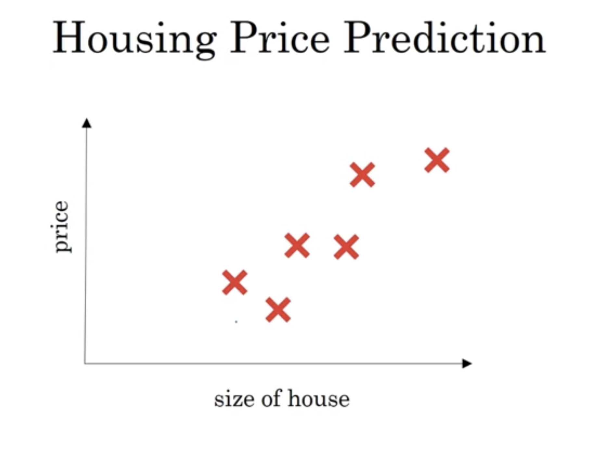
- let's say this blue line is our function for predicting the price of the house against its size.
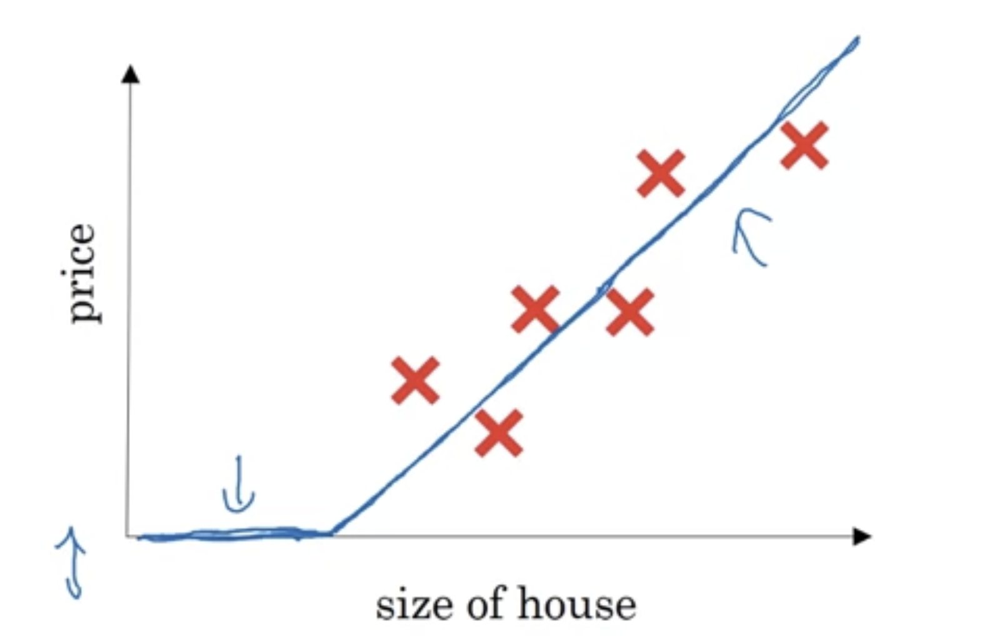
- we can think of this function as a very simple neural network.
- we have an input to the neural network which is our size let's say x, it goes into a node and outputs the price let's say y.
- this node is a neuron that implements this function that blue line one.
- **neuron takes in the input of the size, computes the linear function, takes a max of zero and then outputs the price.**
- This function is very famous in the neural network literature. This function will go zero sometimes and then it takes off as a straight line.
- This function is called the **ReLU function which stands for Rectified Linear Units**
- rectify just means taking a max of zero.
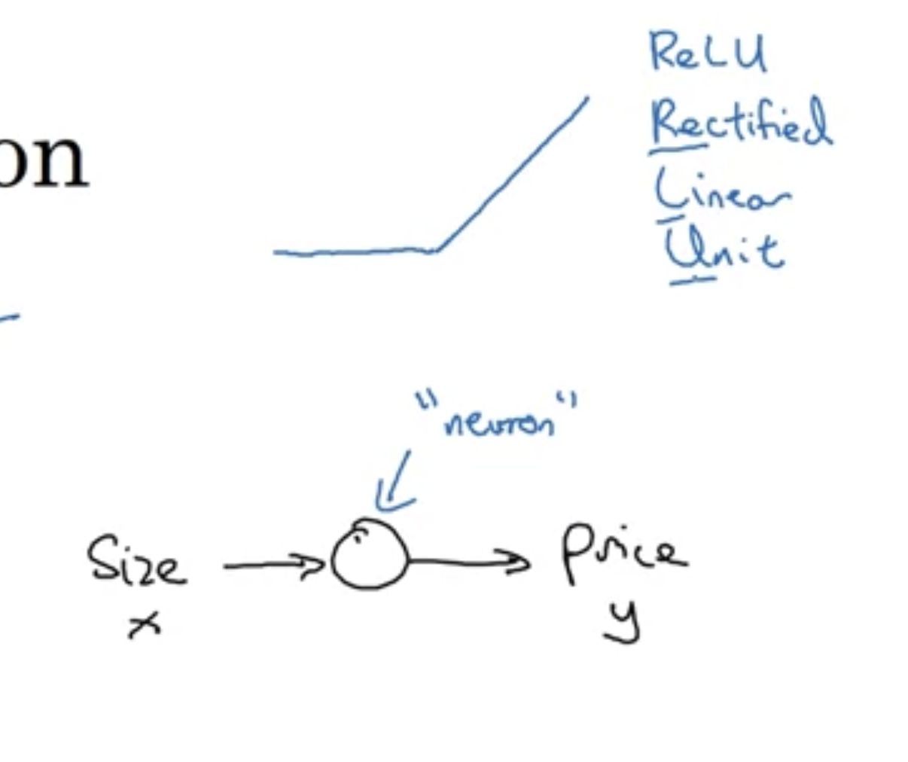
- This is a single neuron neural network and a larger neural network is formed by taking many of the single neurons and stacking them together.
- Let's say we have now other features for predicting the price of the house not only size.
 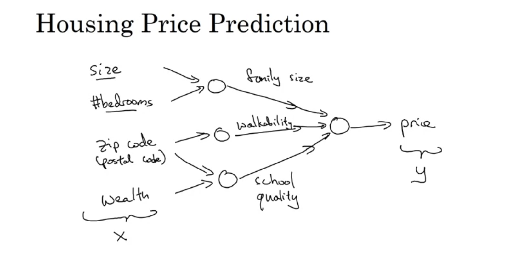
- how we manage a neural network is, by giving it the input x and the output y for a set of training examples and the middle layers will figure by itself.
- The job of the neural network is to predict the price y for given inputs x.
- the middle layers are called hidden units in the neural network, each of them takes input of all four input features.
- So, rather than saying this first node represents family size and family size depends on the features x1 and x2. Instead, we say neural network u decide whatever u want this node to be. We will just give u all four features to compute whatever u want.

# Let's see some examples of Supervised Learning:-
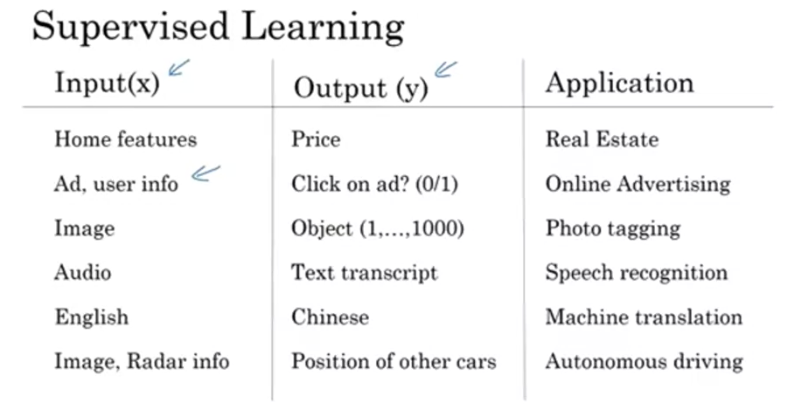
- So, a lot of value creation in neural networks is through selecting what should be x and what should be y for your particular problem and then fitting this supervised learning component into a bigger system such as an autonomous vehicle.
- It turns out that slightly different types of neural networks are more useful in different applications.
- for real estate and online advertising, we use a standard neural network, for image applications we will often use Convolutional Neural Networks, for one-dimensional sequence data we often use an RNN, such as audio or machine translation.
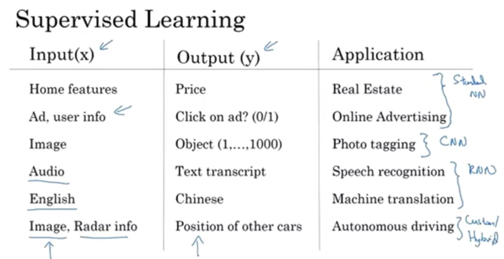
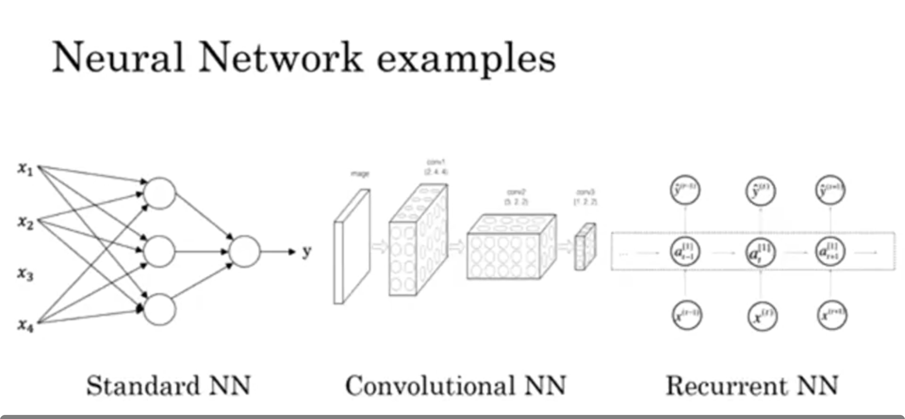

- We have also heard about applications of machine learning in both structured data and unstructured data.
- Structured data means basically a database of data. Here the features have a very well-defined meaning. For example:- bedrooms, size of house etc.
- Unstructured data refers to things like raw audio, raw image, and text. Here the features might be the pixel value.
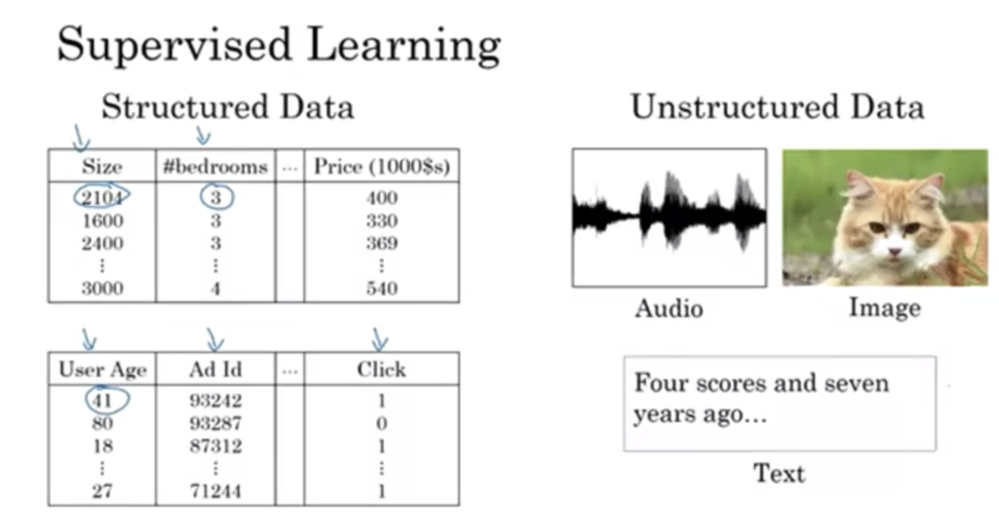
- Interpreting unstructured data is tough. But thanks to neural networks, computers have become better at interpreting unstructured data.

# The basic ideas behind neural networks and deep learning happen to be there for decades then why is it taking off now only?
- In the last 10 years, we have relatively a very high amount of data.
- If you want to hit a very high level of performance, then we need two things:- 
1. Size of the neural network, meaning a network with a lot of hidden units. You need to be able to train a big neural network in order to take advantage of the huge amount of data.
2. You need a very huge amount of labelled data.
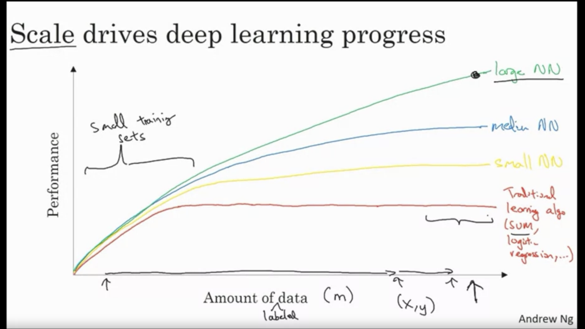
- Algorithmic innovation has also made neural networks run faster.
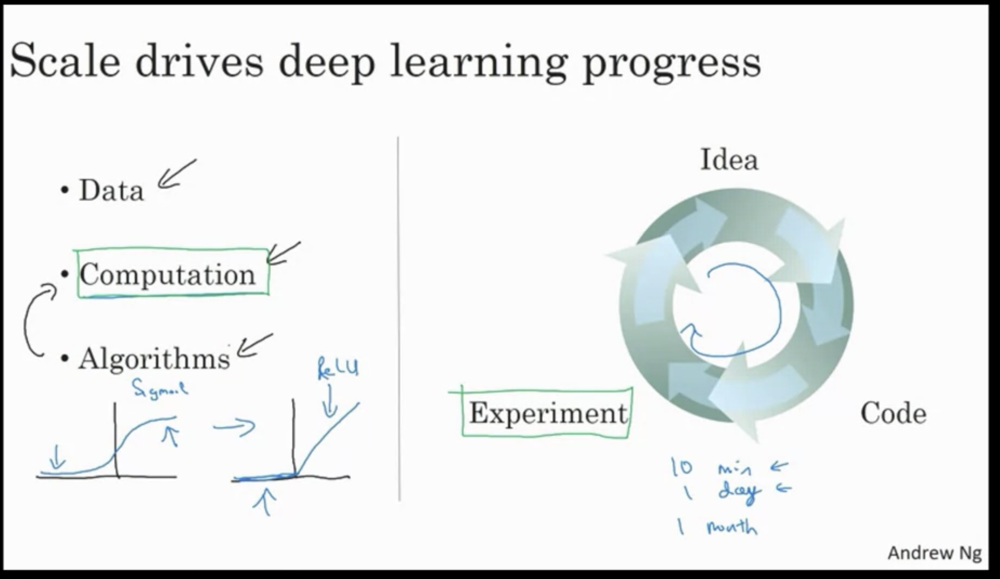
- In this course, the variable m would denote the number of training examples.

# Logistic Regression as a Neural Network
- Logistic Regression is an algorithm for binary classification.
- Here's an example of a binary classification problem:- You have an input of an image and want to output a label to recognize this image as either being a cat in which case you output 1 and not a cat in which case you output 0.
- Let y denote the output label.
- For storing an image, your computer stores three different colour matrices corresponding to the red, green and blue colour channels of the image. 
- If the input image has 64 * 64-pixel values, then in total there are 3  64 *  64 matrices corresponding to red, green and blue pixel intensity values for our image.
- So, to turn these pixel intensity values into a feature vector, what we will do is unroll all of these pixel values into an input feature vector x.
- 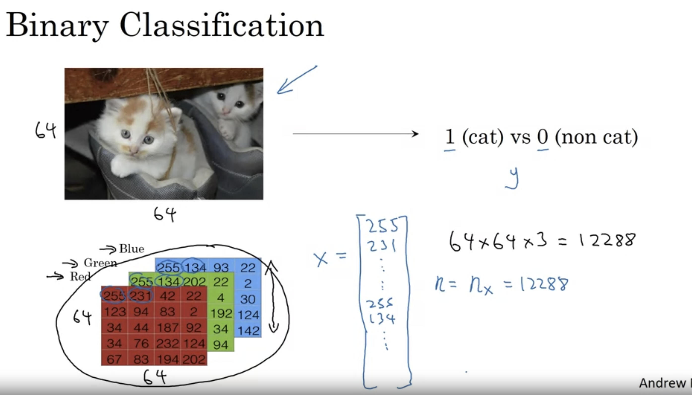
- if this image is 64 * 64 image, then the total dimension of this vector x is 64 * 64 * 3.
- So, we will use n(subscript x) or n to represent the dimension of the input feature x.
- So in binary classification, our goal is to learn a classifier that can input an image represented by a feature vector x and predicts whether the corresponding label y is 1 or 0.
 # Notation:-
1. A single training example is represented by a pair(x,y) , where x is n subscript x dimensional feature vector and y is either 0 or 1.
2. your training sets comprise m lowercase training examples.
3. So, your training sets will be written (x1,y1) which is the input and output for the first training example, (x2,y2) is the input and output of the second training example, (xm,ym) is your last training example.
4. To write this is the number of training examples, we will write m subscript train.
5. when we talk about the test set we will write m sub-script test to denote the number of test examples.
6. To output all of the training examples, we will define a matrix capital X which takes all the training inputs and stack them in columns.
7. This matrix X has m columns and where m is the number of training examples and the number of rows is n subscript x.
8. Hence X is a nx * m dimensional matrix.
9. Output of X is Y which is also stacked in columns.
10. So, Y is a 1 * m dimensional matrix.
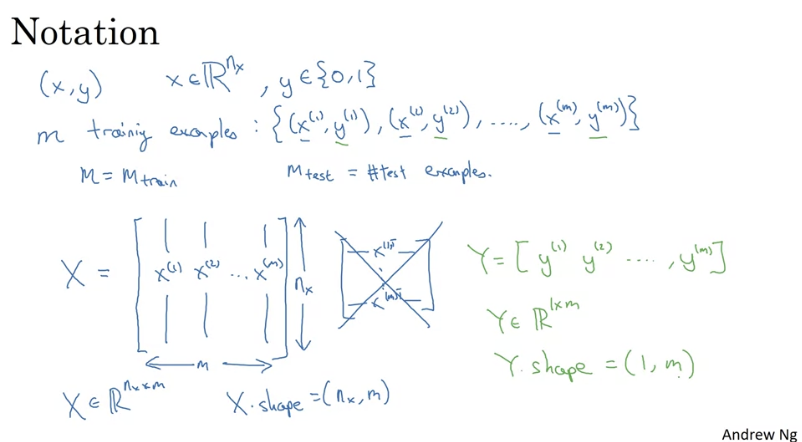
## Logistic Regression
- It is a supervised learning algorithm that we use when the output label y is all either 0 or 1, so for binary classification problems.
- Given an input feature vector x corresponding to an image that you want to recognize as either a cat picture or not a cat picture.
- we want an algorithm that can output a prediction which we will call y hat, which is our estimate of y.
- More formally, we want y hat to be the probability of the chance that y is equal to 1 given the input features of x.
- In other words, if x is a picture, we want y hat to tell what is the chance that this is a cat picture.
- X is a n subscript x dimensional vector.
- given that the **parameters of the logistic regression will be W which is also an n subscript x dimensional vector, together with b which is just a real number.**
- So, given an input x and the parameters w and b, how do we generate the output y hat?
		- So, one thing we can try that doesn't work would be to have y hat be w transpose X + b, which is a linear function of input x.
		- This is what we use for linear regression but this is not a very good algorithm for binary classification because here we will get a big output even negative and not between 0 and 1.
		- Y hat is the probability of whether the image is of a cat or not and it should be between 0 and 1 only. 
		- so we will apply the sigmoid function it will give output between 0 and 1 only.
		- So, when we implement logistic regression our job is to learn parameters w and b so that y hat becomes a good chance of estimate of y equal to 1.
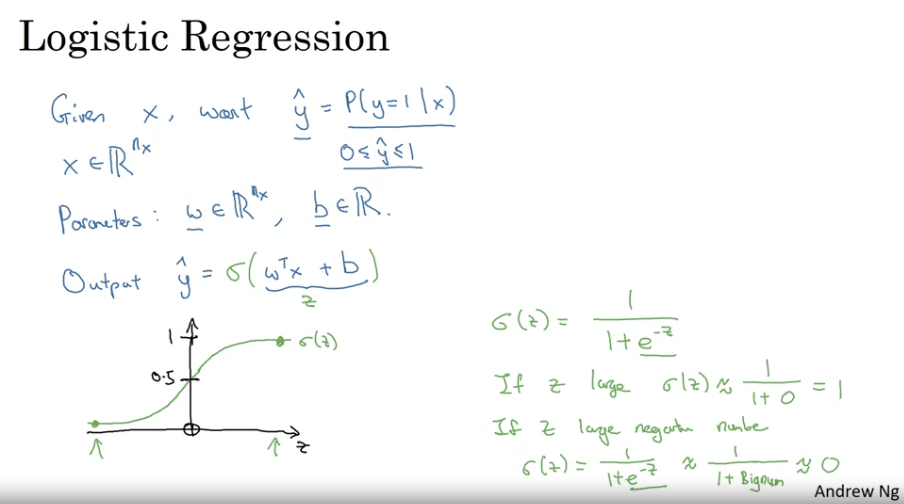
- In some notations, b and w are considered as a single parameter like this:-
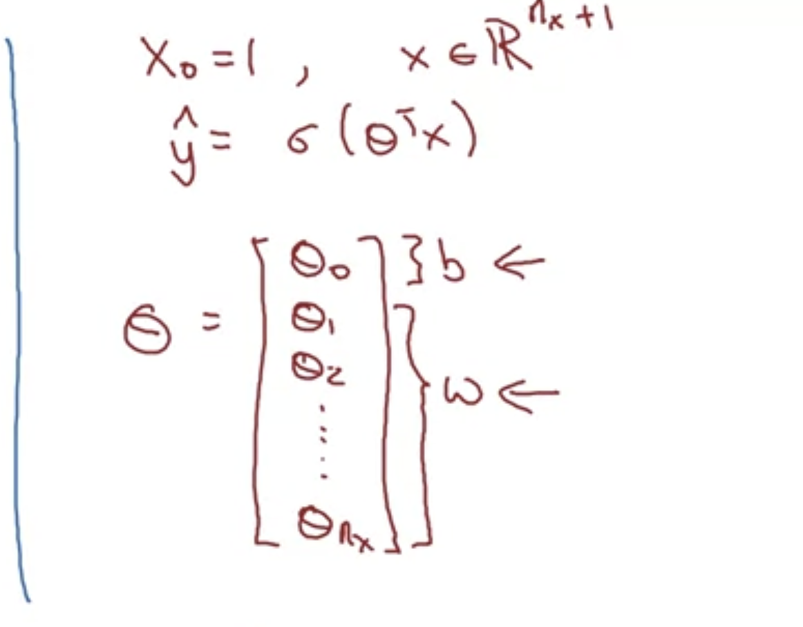
But, in our case, we will consider b and w as separate parameters only.
## Logistic Regression Cost Function
- To train the parameters of the logistic regression model we need to define cost function.
- we are given a training set of m training examples and we want to find the parameters w and b so that at least on the training set y hat is close to y.
- Here, superscript i refers to ith training example.
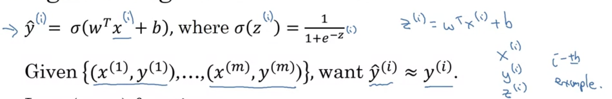
## Loss function
- we use the loss function to see how well our algorithm is doing.
- we could define the loss function as the difference of the square error.
- But, it turns out that in logistic regression people don't usually do this, because here we would have multiple local minima. Therefore gradient descent doesn't work well. Here, we have a different loss function.
- L is a loss function that is used to measure how good our output y hat is when the true label is y.
- We want this loss function to be as small as possible.
- This new loss function says if y is equal to 1, we want y hat to be as big as possible that is close to 1.
- And if y is equal to zero we want y hat to be as small as possible that is close to 0.
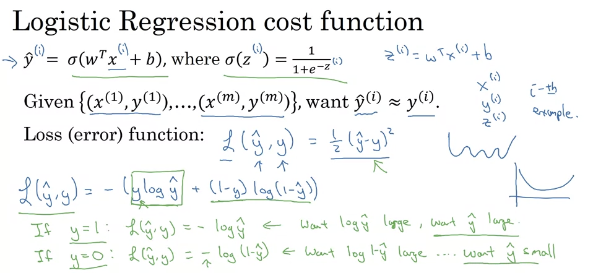
loss function is defined with respect to a single training example, it defines how well you are doing with respect to a single training example.
- The cost function **(Represented by J)** defines how well you are doing on the entire training set.
- It is applied to parameters w and b.
- It is going to be the average of the loss function applied to each training example.
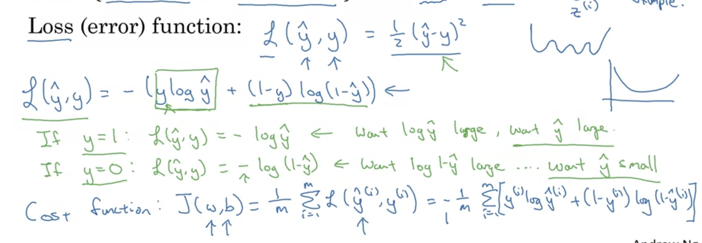
- So, in training your logistic regression model we are going to find the parameters w and b that minimizes the overall cost function.

## Gradient Descent
- Using the gradient descent algorithm we can train the parameters.
- w and b can be considered as horizontal axes and the cost function J(w,b) is some surface above these horizontal axes.
- We want to find the value of w and b that correspond to the minimum of the cost function J.
- here, the cost function is a convex function. Hence we can find the global minima. 
- In case of not a convex function, there are many local minima.
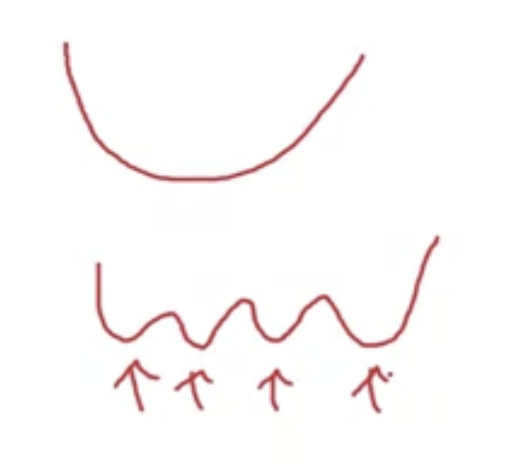
- Since this cost function is convex instead of non-convex is one of the main reasons we defined this cost function instead of square error one.
- So, here we will initialize w and b randomly generally 0 is considered. Any initialization works because the function is convex and no matter where we will initialize we will always end up at the same point.
- Then, what gradient descent does is take a step in the steepest downhill direction.
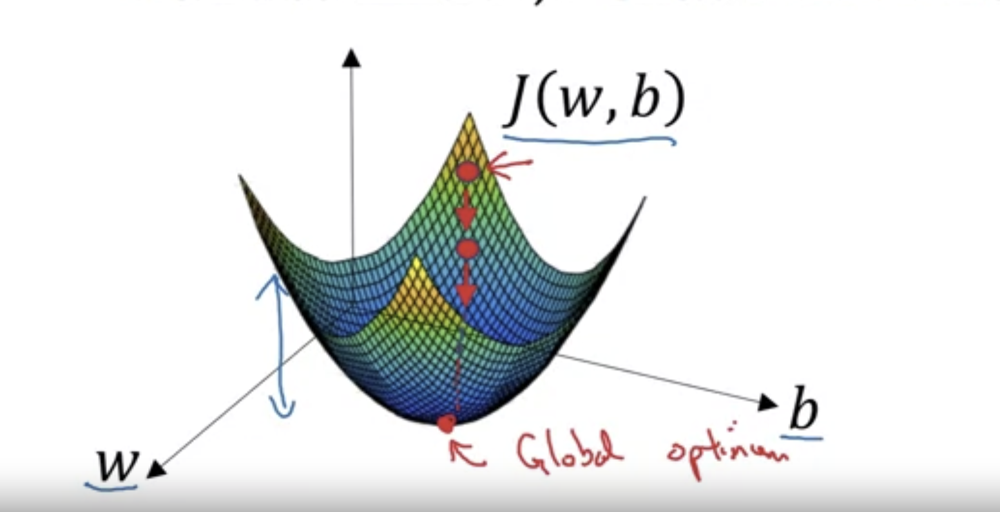
- let's say there is some function J(w) that we want to minimize.
- and then, we will repeatedly carry out the following update.
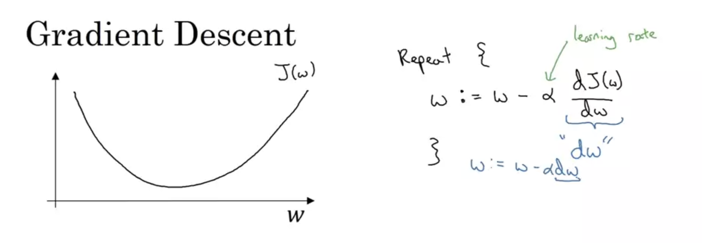
- Alpha here is the learning rate and controls how big a step we take on each iteration in gradient descent.
- And this derivative is the update, the change we want to make to the parameters w. To represent this derivative we will use the variable name dw. 
- This derivative just represents the slope of the function.
- If the w value is high, then at that point in the curve the derivative value is positive and hence we end up subtracting from w, and hence we go near the minimum.
- If the w value is low, then at that point in the curve the derivative value is negative and hence we end up adding to w, and hence we go near the minimum.
- hence we will always move towards the global minimum.
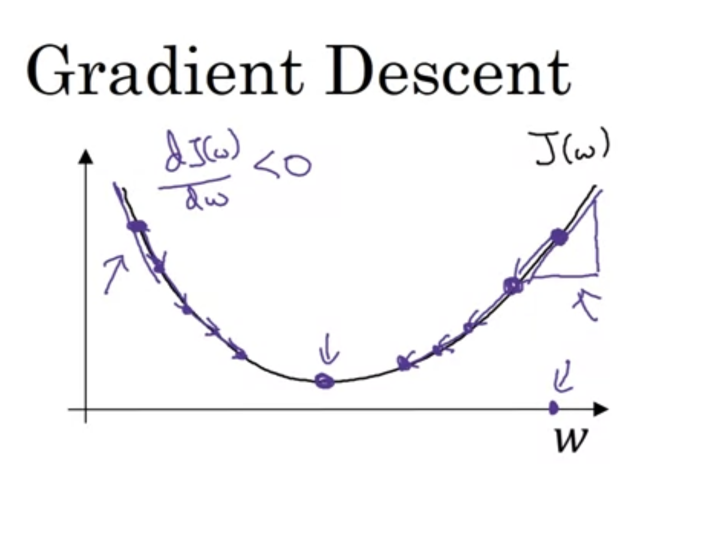
- here we just considered w.
- but in actuality, we update both w and b.
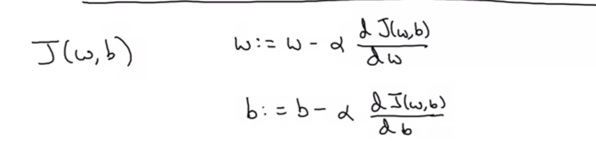
- We will denote the first derivative which is the amount by which we want to update w, by dw in the code. And the second derivative that is the amount by which we want to update b by db in the code.

# Derivatives
- Consider a function f(a)=3a
- let's say a=2, therefore f(a)=6
- if we give a small nudge to a by 0.001... let's say now it becomes a=2.001, therefore f(a)=6.003
- we see if we nudge a by 0.001 then f(a) goes up by 0.003.
- therefore f(a) increases by 3 times of our nudge.
- slops is just the height/width of the triangle that we see in the photo.
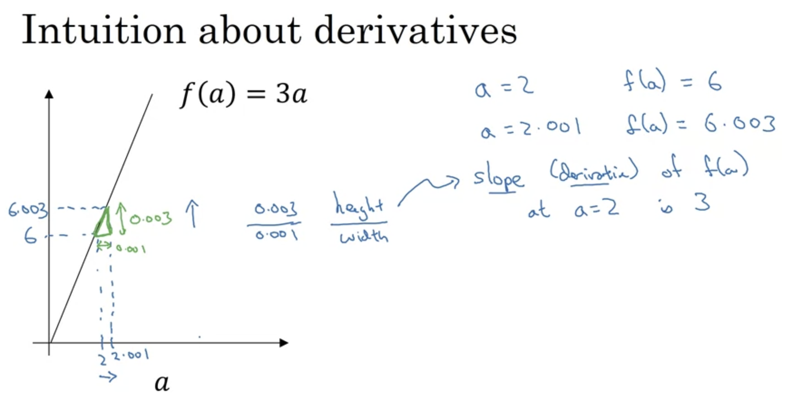
- the slope is equal to 3 just represents that when you nudge a to the right by 0.001, the amount that f(a) goes up is 3 times as big as the amount that you nudge it.
- Actually, in a more formal definition we don't nudge by a, we nudge by an infinitesimal amount.
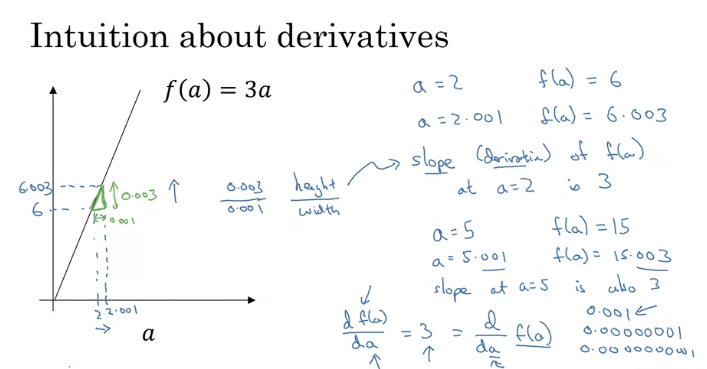
- Here, the slope of a function is the same at different times like when we take a=3 and when we take a=5.
- This is not always the case:-
Consider a function f(a)=a^2
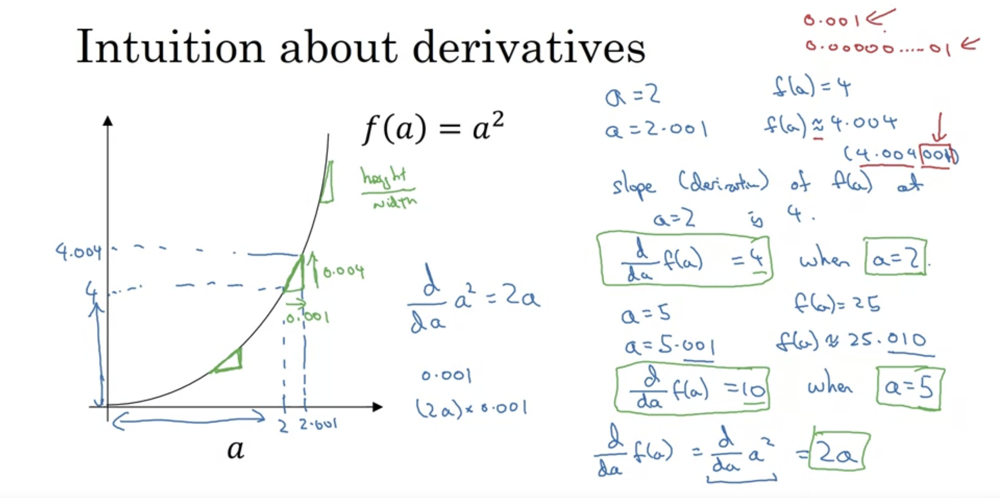
Here, at a=2 and a=5 f(a) is different.
- one way to see why this derivative is different is because when we draw the triangle at different locations, the ratio of height/width is very different at different locations.
- derivative of a^2 is =2a, this just means that if we nudge the value of a by 0.001 then we will expect f(a) to go up by 2a times of the nudge.
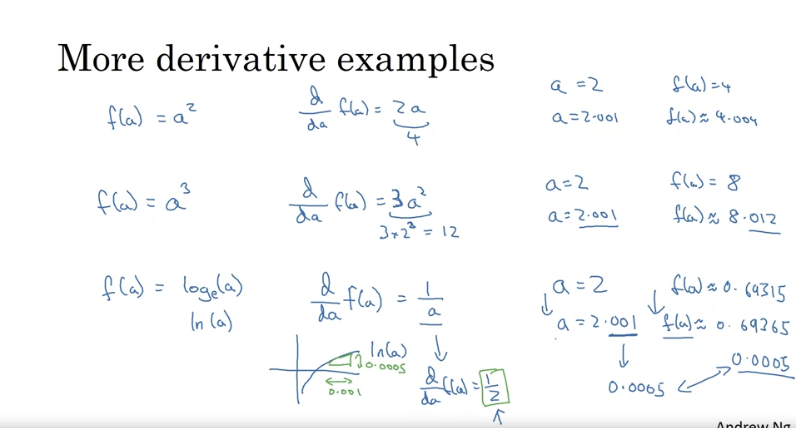
# Computation Graph
- The computation of a neural network is organized in terms of a forward pass or forward propagation step in which we compute the output of a neural network, followed by a backward pass or back propagation step, which we use to compute the gradient.
- The computation graph explains why is it organized this way.
- let's say we trying to compute a function J which is a function of 3 variables.
- J(a,b,c)=3(a+bc)
- let's say here we have three different steps to compute the function.
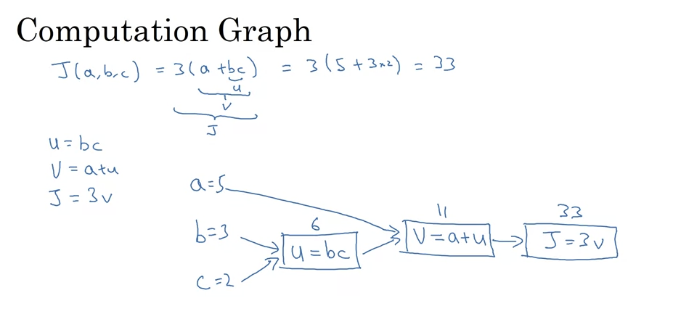
- So, the computation graph is helpful when we have a variable that we want to optimize.
- In the case of the logistic regression, J is the cost function.
- So, the computation graph organises the computation with this blue arrow left to right computation, which is the forward propagation.
- For finding derivative we will do backward propagation.
- Backward propagation means for finding the derivative of the final output variable like dJ/da, we will need dv/da(previous output), hence backward propagation, because dJ/da=dJ/dv * dv/da 
-  In many cases, there will be a final output variable and we would need to find the derivative of this final output variable with some previous variable, For example here our final output variable is J and we are finding its derivative with respect to v, a,u etc. 
- We will represent the derivative of the final output variable with respect to variables like a, u , and v by dvar in the code.
- So, dvar will represent the derivative of the final output term with respect to various intermediate quantities.
- Like dJ/dv=dv in representation.
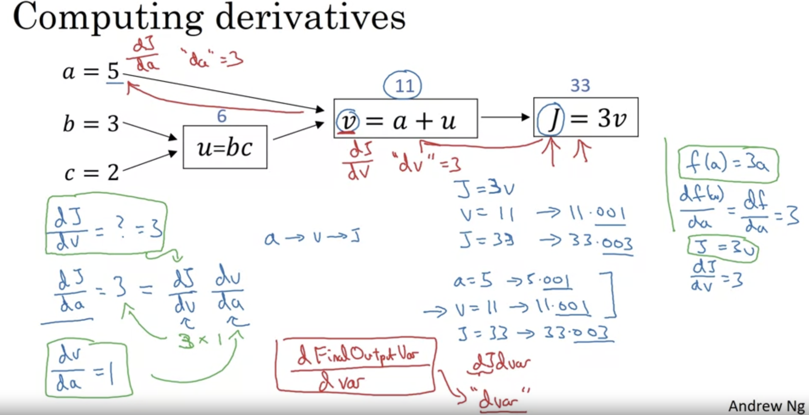
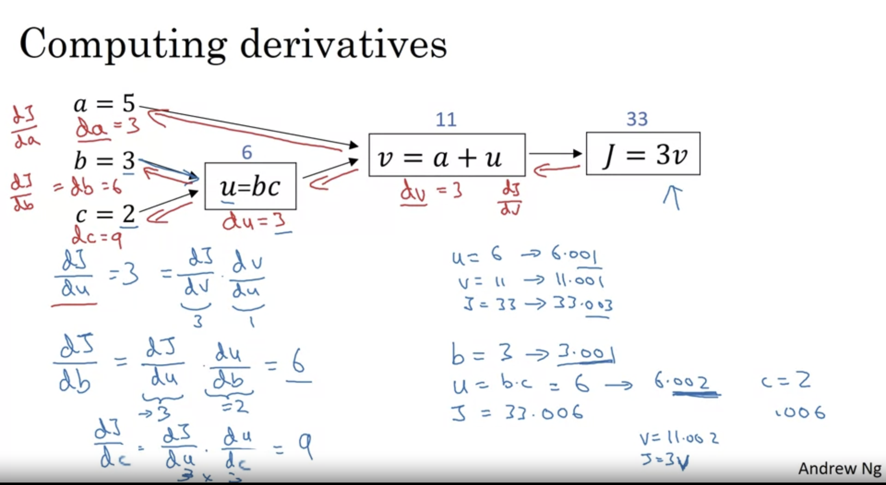
- Hence the most effective way to compute all these derivatives is right-to-left computation, that is following the direction of the red arrows.
# Derivatives in Logistic Regression
Now, let's learn how to compute derivative for implementing gradient descent
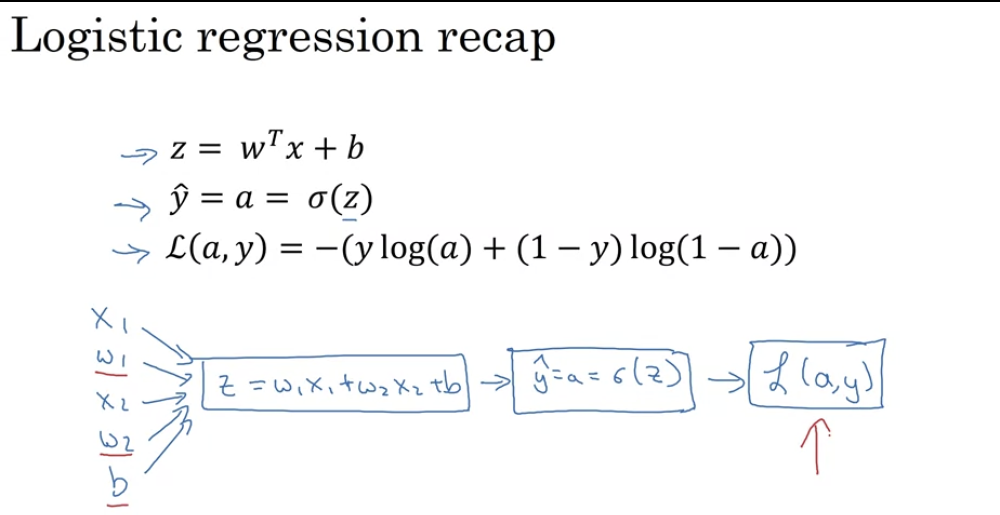
In logistic regression, we want to modify the parameters w and b in order to reduce the loss.
- We can find the derivative dL/da, then we can find the derivative 
dL/dz. 
dL/dz=dL/da * da/dz and the derivative da/dz comes out to be 
a(1-a) and we already have dL/da so just multiply them and we get dL/dz as (a-y).
- Now, we need to compute how much we need to change w and b.
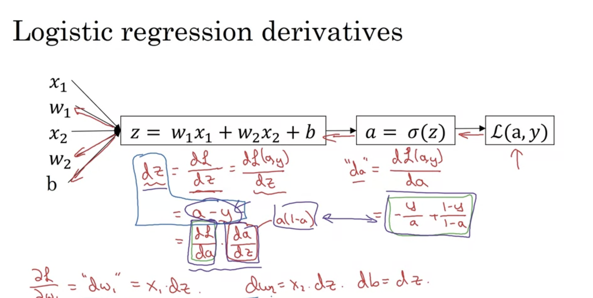
so, we will first find dz and then we will compute dw1, dw2 and db.
and then, we perform the update 
w1:=w1-alpha * dw1.
w2 :=w2-alpha * dw2.
b :=b-alpha * db.
- This is computing gradient descent for just one training example. But in the model of neural networks, there will be m training examples. So let's compute gradient descent for the m training example.
- The cost function is the average of all the loss functions.
- It turns out that the derivative of the cost function with respect to w1 also turns out to be the average of the derivative of the individual loss function with respect to w1.
- So, we just need to compute these derivatives as shown above and then average them. This will give you the overall gradient which we will use to implement gradient descent.
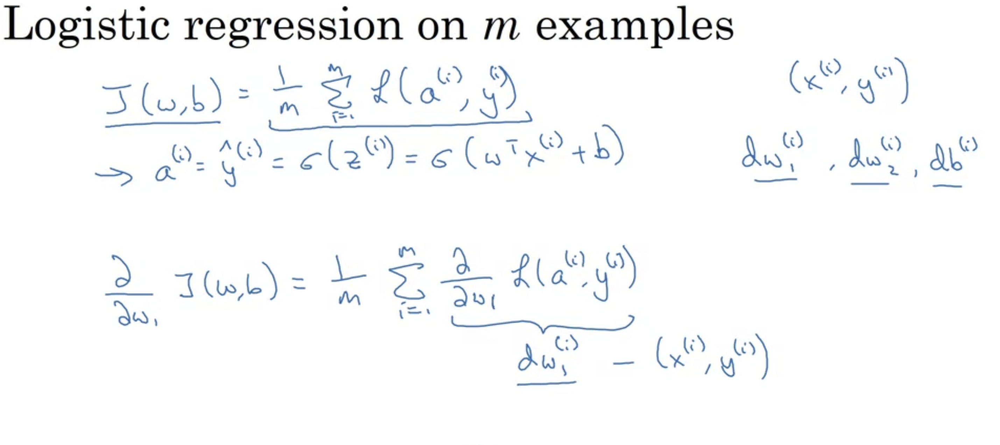 
Algorithm is as shown:-
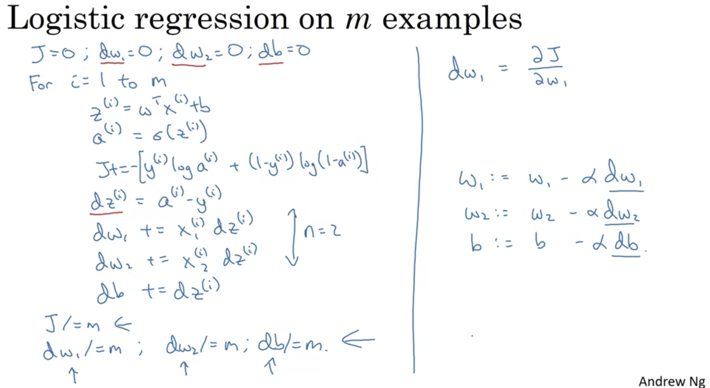
- After doing all of these calculations, we computed the derivative of cost function J with respect to all parameters w1,w2 and b.
- After doing all this calculation then to implement one step of gradient descent we will update 
w1 := w1-alpha * dw1.
w2 := w2-alpha * dw2.
b := b-alpha * db.
- Here, we considered n as 2 that is we have only 2 features but in actuality features are so many.
- So, here we would need to apply two for loops one for m training examples and another one for all the features.
- We find that having explicit for loops in the code makes it less efficient.
- So, we want to implement our algorithm without using explicit for loops.
- So, there are certain techniques called **vectorization techniques** using which we will implement our algorithm with no for loops.
## Vectorization
Vectorization is the art of getting rid of the explicit for loops in your code.
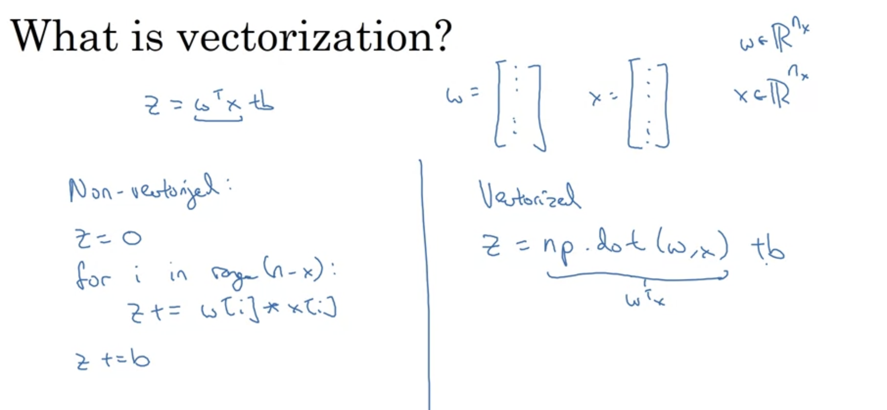
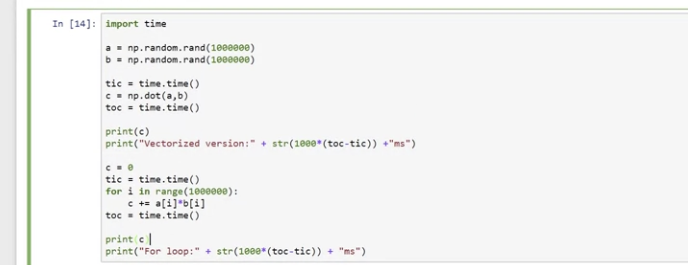
output of the above code is :-
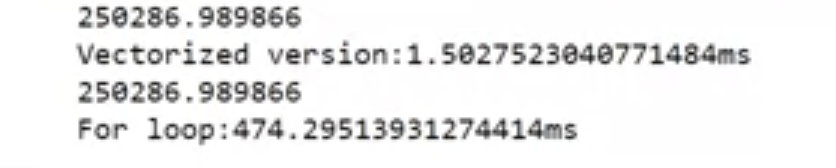
In both cases(the vectorized version and non-vectorized version), we get the same output of c but we can see the time difference.
The vectorized version is very fast.
More examples are:-
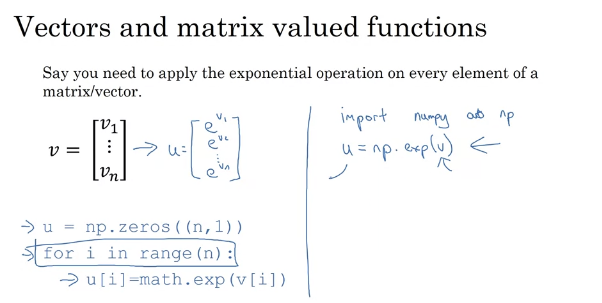

similarly we have, np.log(v), np.abs(v) etc.
**In logistic regression we can eliminate one for loop as shown:-**
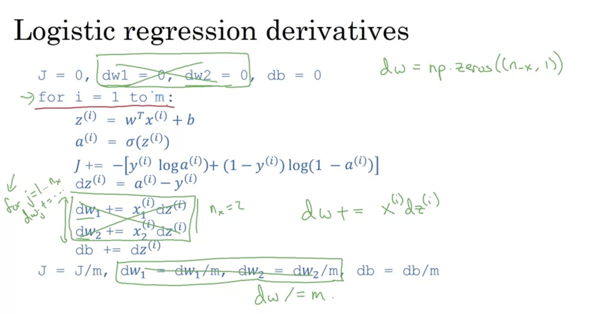
- Some operations of the second for loop can be eliminated as shown.
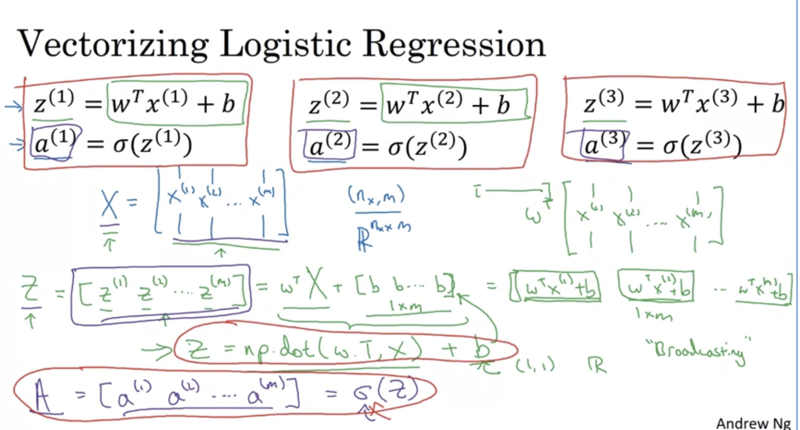
- Here, b is a real number. When we add this np. dot(w.T, X) to b, Python automatically expands b into a 1 * m matrix.
- This expansion of b is known as broadcasting in Python.
- we can get rid of other for loop operations as follows:-
  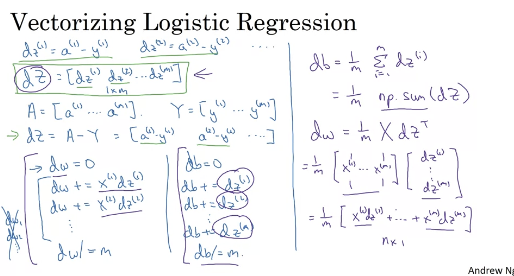
  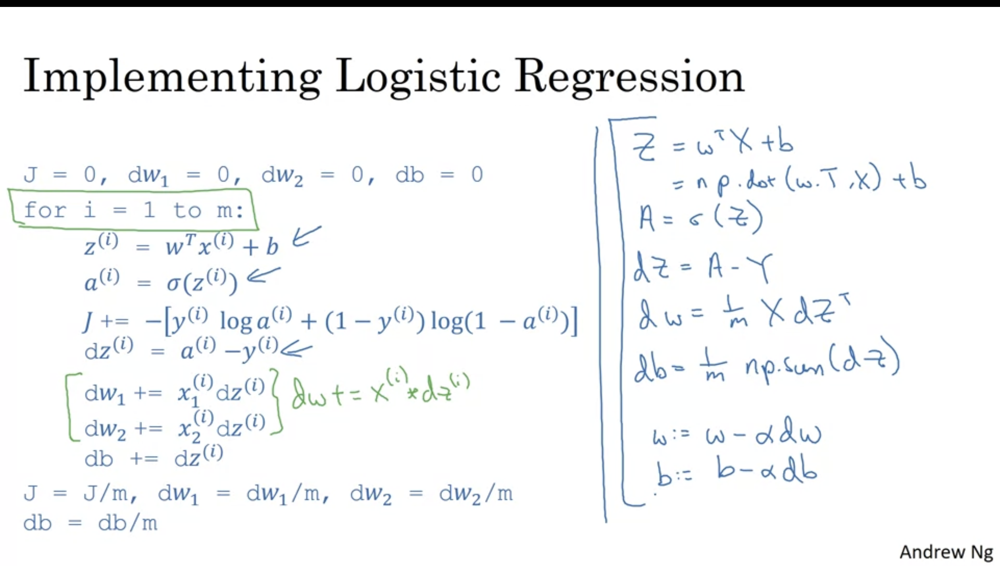
  This is just a single iteration of gradient descent for logistic regression.
  - **If you want to do multiple iterations of gradient descent then you still need a for loop. We cannot get rid of that for loop.**
  
  # Broadcasting in Python
  - let's say we have a 3 * 4 matrix containing calories and now we want to calculate the percentage of carbs, proteins and fats in different items and store it also in a matrix.
  - so we want to sum up number of calories in each column. and divide the number of total calories with all items of a row.
  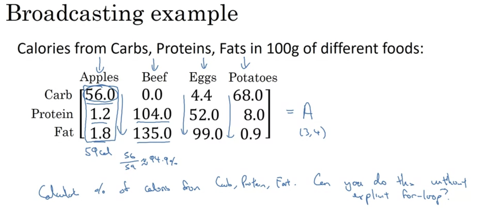
  A.sum(axis=0) means sum up the columns A.sum(axis=1) means sum up the rows.
  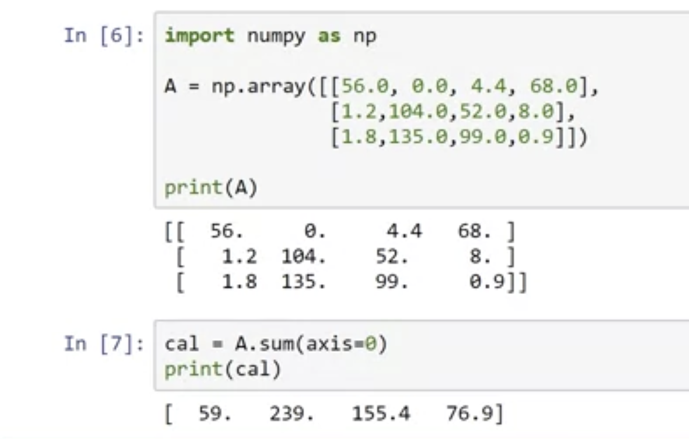
  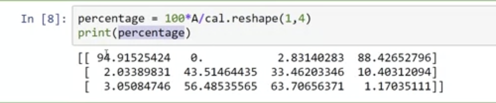
  Here we are dividing a 3 * 4 matrix by a 1 * 4 matrix, this is an example of python broadcasting.
  - Here, .reshape is redundant because cal is already a 1 * 4 matrix.
  - If we take a 4 * 1 vector and add it to a number, python would auto expand this number into a 4 * 1 matrix as well.
  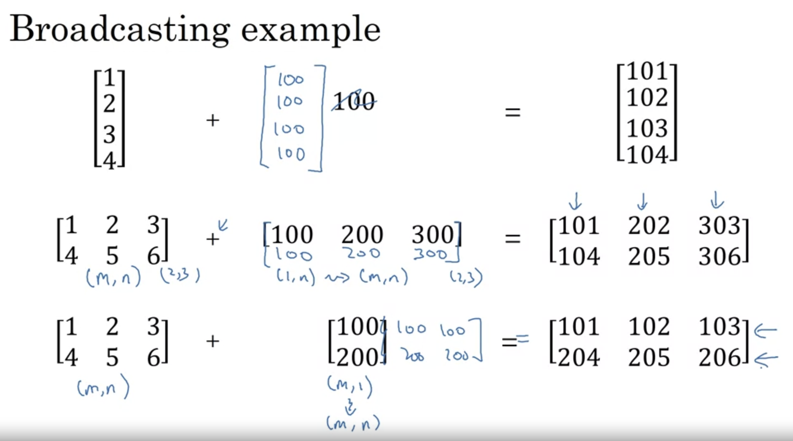
  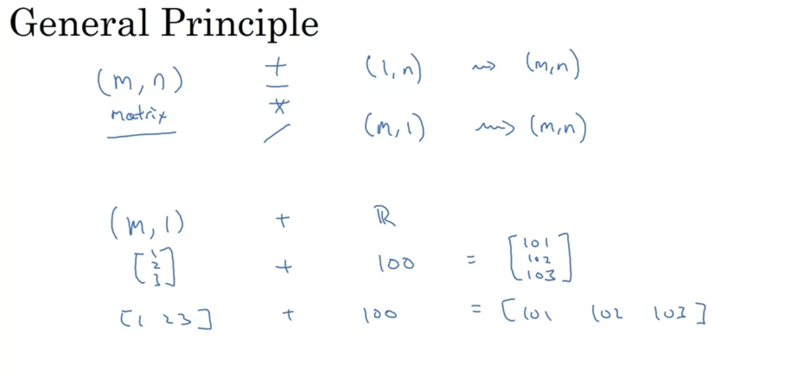
 
   - **Let's get some more insights of the python numpy library.**
   - if we create an array like this 
   a = np. random.randn(5)
   then a rank 1 matrix is formed neither a column vector nor a row vector. This rank 1 matrix behaves odd. But we find a.T(a transpose) it will end up looking the same.
   And the product will be a number and not a matrix.
   - 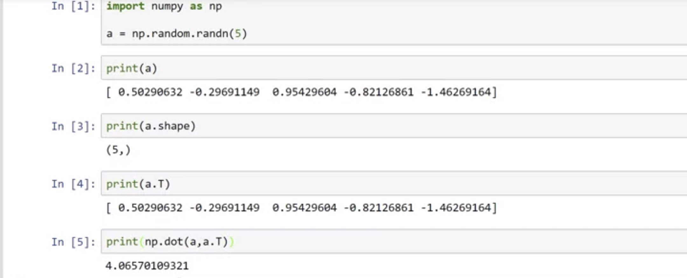
   - What is recommended is to not use structures like this where the shape is (5,) or something 
   - Create either a row vector or column vector at the start only.
   - do this command instead
   a = np.random.randn(5,1)
   this creates a row matrix.
   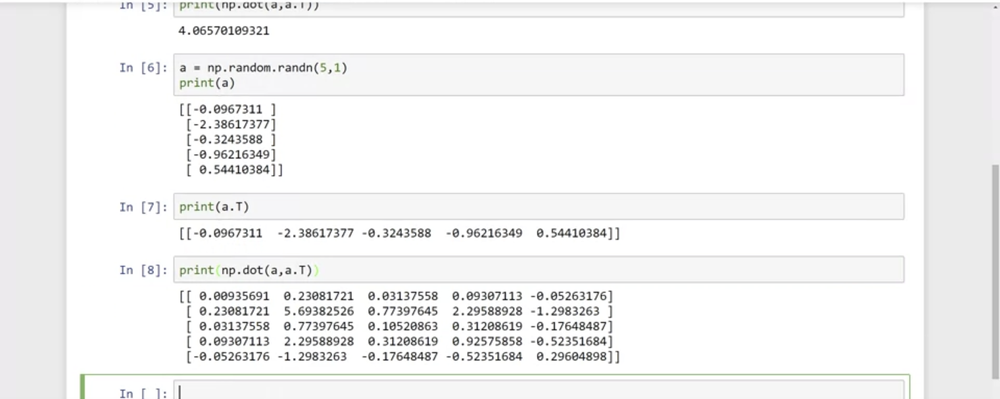
   - Here, if we multiply the matrix a and its a transpose, we will get a matrix and not a number. It should be like this only.
   - when a.shape =(5, ), it should be bad.
   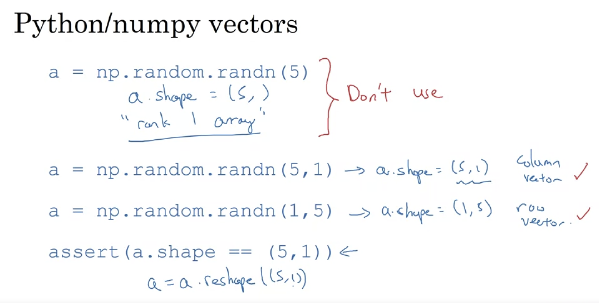
   - If you are not sure what is the dimension of your array, use an assertion statement. This assertion makes sure that it is a required vector.
   - if we end up with a rank 1 array use the .reshape command in Python.
   
   # Important points
   - * In Python does the element-wise product and dot() function in Python actually do the matrix multiplication.
   - **Actually, we rarely use the "math" library in deep learning because, in the math library, the inputs of the functions can only be real numbers. In deep learning, we mostly use matrices and vectors. This is why Numpy is more useful because in Numpy we can have inputs as matrices and vectors.**
   - Two common Numpy functions used in deep learning are [np.shape](https://docs.scipy.org/doc/numpy/reference/generated/numpy.ndarray.shape.html) and [np.reshape()](https://docs.scipy.org/doc/numpy/reference/generated/numpy.reshape.html).
- **X.shape is used to get the shape (dimension) of a matrix/vector X.**
- **X.reshape(...) is used to reshape X into some other dimension.** This new dimension product should be equal to the current dimension product.
- For example, in computer science, an image is represented by a 3D array of shapes (𝑙𝑒𝑛𝑔𝑡ℎ,ℎ𝑒𝑖𝑔ℎ𝑡,𝑑𝑒𝑝𝑡ℎ=3). However, when you read an image as the input of an algorithm you convert it to a vector of shape (𝑙𝑒𝑛𝑔𝑡ℎ∗ℎ𝑒𝑖𝑔ℎ𝑡∗3,1). In other words, you "unroll", or reshape, the 3D array into a 1D vector. This is known as **image2vector()**.
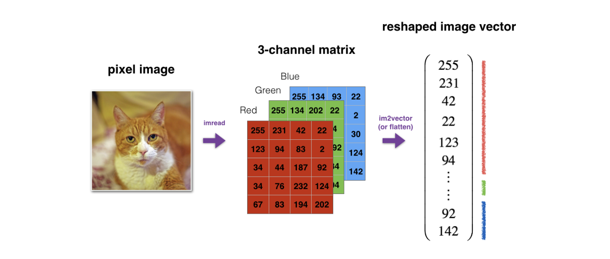

- To **normalize** a matrix means to scale the values such that the range of the row or column values is between 0 and 1.
-  It often leads to a better performance because gradient descent converges faster after normalization. Here, by normalization, we mean changing x to x/x_norm (dividing each row vector of x by its norm). So, now the range will be 0 to 1.
- np.linalg.norm(x, axis=1, keepdims=True), this function is used for normalization of matrix x.
	- With `keepdims=True` the result will broadcast correctly against the original x. It prevents Python from outputting those rank 1 arrays. (n,)
	- `axis=1` means you are going to get the norm in a row-wise manner
	-  NumPy.linalg.norm has another parameter `ord` where we specify the type of normalization to be done

**Numpy is the fundamental package for implementing scientific computation with Python**.

A trick when you want to flatten a matrix X of shape (a,b,c,d) to a matrix X_flatten of shape (b∗c∗d, a) is to use:
```python
X_flatten = X.reshape(X.shape[0], -1).T      
# X.T is the transpose of X
```

- Standardization here means normalization.
- we normalize by dividing the image array by 255(the maximum value of a pixel).
- 


# Neural Network with multiple layers
- Till now, we have been talking about logistic regression.
- Previously, this only node corresponded to two steps of calculation, the first is to compute the z value and the second is to compute the a value.

- A neural network is more complex, it has multiple layers.
- 
- We can form a neural network by stacking together all the sigmoid units.
- In this neural network, the first stack of nodes corresponds to z like calculation as well as a like calculation.
- The next node in the other layer will also correspond to another z and another a-like calculation.
- Now, we will use superscript square brackets to refer to a stack of nodes.
- like for first layer z we will do z^(superscript)[1], and for second layer we will do z^(superscript[2]).
- **Note**- These superscript square brackets are different from superscript round brackets.
- We used round brackets for referring to the training example.
- In this neural network, a^superscript[2] is the final output of the neural network.

 - Here, the term hidden layer means that the true values in these nodes are not known. That is we don't know what they should be in the training set.
- We see what the inputs are and what the outputs are. However, the things in the hidden layer are not seen in the training set.
- Previously, we were using the vector X to represent the input features, an alternative notation is to use a^superscript square brackets. The term a stands for activation. 
- It refers to the values the layers are passing on to the subsequent layers.
- When we count layers in the neural network, we don't count the input layer.
- We call the input layer layer 0.
- Hence this is a 2 layer neural network.

# Let's see how this 2 layer neural network computes
- It is like logistic regression but repeated a lot of times.
- node in logistic regression represents two steps of computation. One is finding z and the other is finding a that is the sigmoid of z.
- A neural network just does this a lot more times. Here, each node represents the above computation.

- Finding z for all the nodes one by one or using a for loop is less efficient. So, let's vectorize it.

- Here, we have four logistic regression units and here unit has a corresponding parameter vector w and B.
- By stacking those parameter vector w, we get W. That is a   4 * 3 matrix.
- 

# Vectorizing across multiple training examples.
- Using input feature vector X we computed yhat for a single training example.
- Now, if we have m training example, we have to perform the same steps for m times.
- We use for loop in unvectorized implementation.


Vectorization implementation is as shown:-
- Horizontally, the matrix goes over different training examples and vertically the different indices in matrix A correspond to different hidden units.


# Justification for Matrix Multiplication

for ease we didn't consider, b.

# Activation function 
- So far we have been using the sigmoid activation function, but sometimes the other choices work better.
- Sigmoid is called an activation function.
- An activation function that always works better than the sigmoid function is the hyperbolic tangent function. It goes between +1 and -1.
- hyperbolic tangent function is just a shifted version of the Sigmoid function.
- It turns out that for hidden units if the activation function is tanh(z),  it almost always works better than the sigmoid function.
- This is because, with values between +1 and -1, the mean of the activation function that comes out of the hidden layer always comes out to be near zero. Hence it has the effect of centering your data.
- That is mean of the data will be closer to 0 rather than 0.5. This makes learning for the next layer easy.
- The only exception where we use the sigmoid function is for the output layer because there we need our data to be between 0 and 1. Hence we will use the sigmoid function for the binary classification.
- Hence we have tanh activation for the hidden layer and sigmoid function for the output layer.
- For denoting different functions we use g and not sigma.
- We will use a superscript square bracket with g also to denote that this is activation for this and that layer.
- One of the downsides of the tanh function and sigmoid function is that if z is either large or small then the slope of this function becomes very small and this will slow down the gradient descent.
- So one other choice which is very popular is RELu function.
- Here the derivative is 1 as long as z is positive and 0 if z is negative.
# Rules for selecting activation function are:-
1. If your output is 0 or 1 value then use the sigmoid function.
2. And for all other units RELu or the Rectified Linear unit is used.
- If you don't know which activation function to use, Use RELu function.

- There is another activation function the **Leaky RELu.**
- Here instead of being 0 when z is negative, it takes a slight slope.
- It works better than the RELu but it is not that much used.
- RELu function and leaky RELu function are better because slope of the function going to zero which slows down the learning at high values effect is gone.
- Here, for half of the range slope is 0 but in practice our hidden units will have z greater than 0.


# Why do we need a non-linear Activation function:-

- For our neural network to do interesting functions we do need a non-linear activation function.
- A liner activation function or the Identity activation function is g(z)=z because it just outputs whatever we input.
- **It turns out if we do this, our model is computing y or yhat as a linear function of our input features X that is there is no need for hidden units.**

- Therefore we see that if we use the linear activation function or the identity activation function, then the neural network is just outputting a linear function of the input.
- Therefore we can say that a linear hidden layer is more or less useless.
- There is just one place where we might use a linear activation function that is if we are doing machine learning on a regression problem which means y is a real number. It is not between 0 and 1. Therefore the only place where we might use a linear activation function is in the output layer.
	
# Derivative of the activation function 


- In the case of ReLU and Leaky ReLU function, slope is actually not defined for z=0 but the probability of z being actually equal to exactly zero is almost null.

# Gradient descent for neural networks

 

# Random Initialization
- For logistic regression, it was okay to initialize the weights to zero but for a neural network initializing the weights to zero and then applying gradient descent won't work.
- Turns out that initializing the bias term to zero is okay but initializing the weights to 0 is not okay.
- If weights are all zero, then it turns out that activation is also the same because these hidden units are computing exactly the same function.
- When we compute backpropagation it turns out that derivatives will also be the same.
- Hence if we initialize our neural network this way, our all hidden units will be the same.
- So, it's possible to construct a proof by induction that if you initialize all the weights or all the values of w to 0, then because all the hidden units start off computing the same function and both hidden units have the same influence on the output unit, then even after updating them their value will be the same.
- Hence instead of initializing the weights to zero, initialize the weights randomly.
- After initializing the weights with a random number, multiply it by a small number such as 0.001. So all the values are initialised to very small values.
- We multiply with a small number because we want our values of weights to be initialized small.
- If w values are big, then z is big and if our activation function is the sigmoid function or tanh function we end up with slope 0 or small therefore gradient descent will be slower.
- Sometimes there can be better constants than 0.001.
- When there is only one hidden layer 0.001 will work fine but if we have a lot of hidden layers, we prefer other constants.

# Important points


# **Now we will learn to implement a deep neural network**


- We will use L to denote the number of layers in a neural network.
- We will use n superscript l to denote the number of units in layer l.

- In deep neural networks, there are many layers and we are required to compute activation and Z for all the neural networks, hence we use for loop for that.

# How to find the dimensions of the matrix


# We know that a deep neural network that is, a neural network with a lot of hidden units, works really well in a lot of problems.
- Let's see what a deep neural network is doing:-
It is similar to what we saw in the **3b1b** videos.

- There are mathematical functions that are much easier to compute with deep networks than with shallow networks.


# Building blocks of deep neural networks


# HyperParameters
- Hyperparameters are parameters that control W and B.

- We vary these hyperparameters to decrease the cost as much as possible.
- Deep learning is a very empirical process that is we have to try out a different things to see what works.


# Backward propagation formulas in short:-


# Important points:-


