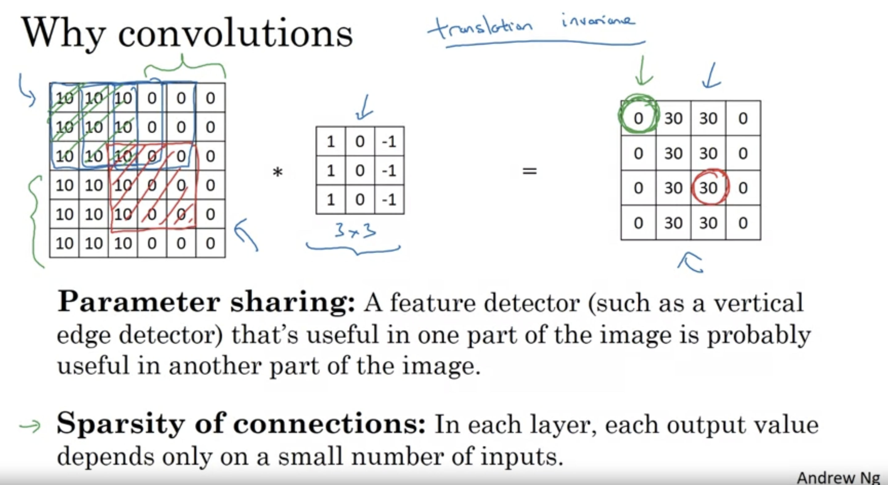
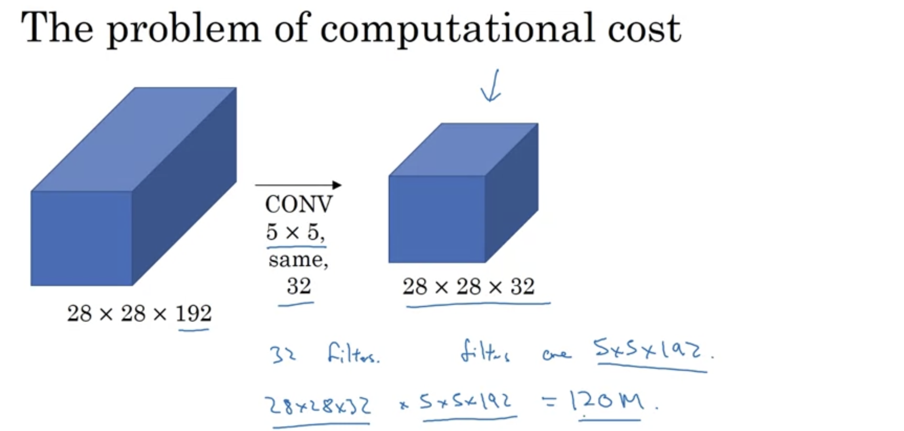
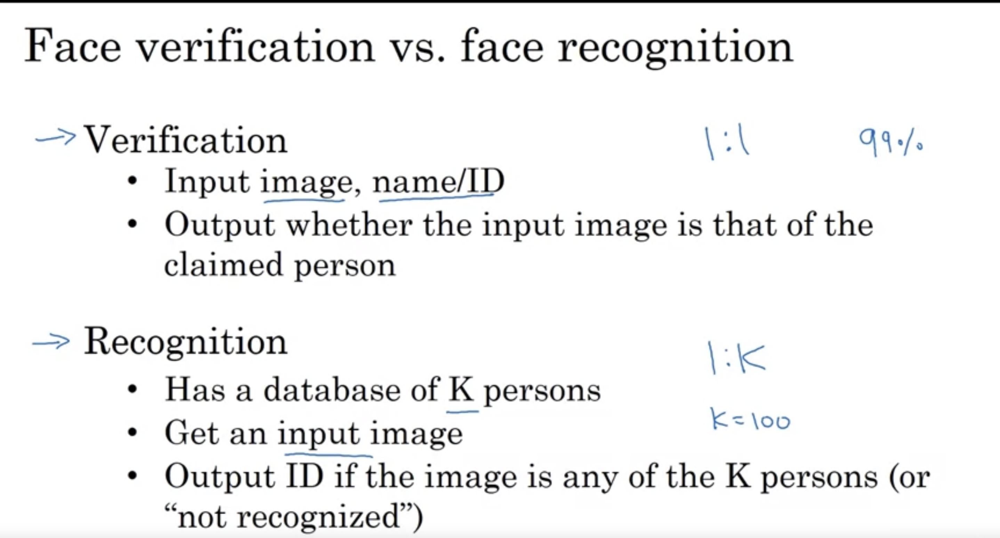
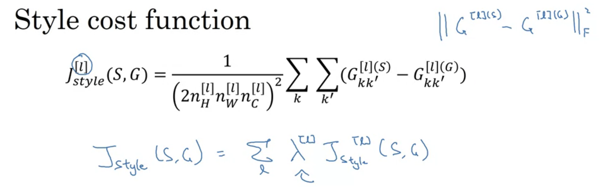

## Computer Vision

- One of the problems with CV is that the input can be really big. For an image with a resolution of 1000 *  1000 * 3 = 3 million pixels and if there are 1000 hidden units in Layer 1, Then a total of 3 billion parameters for just W1.
- In such a big network it's difficult to get enough data to prevent overfitting.
- The computational requirement and memory requirement to train an NN with 3 billion parameters is too much.
- For Computer Vision problems we implement Convolutional operation.
## Edge Detection Example
- 
- For detecting objects, we will first detect edges.
- How are these edges detected?
- Let a grayscale image. In order to detect edges, We will perform a Convolutional operation on it by another matrix. This matrix is known as a filter or a kernel.
- Convolutional operation is generally denoted by an asterisk.
- 
- In the programming framework for performing convolution there are functions:-
		 - In TensorFlow, there is tf.nn.conv2d
		 - In Keras, there is Conv2d.

- Let's see how this is doing edge detection. 
- For that consider a simplified image:-
- The light region in the rightmost image represents that the image has detected an edge.
- The detected edge is thick here because the image is very small. In big images, this is not a problem. 
- 
- So, the vertical edge is a region which has bright pixels on the left and bright pixels on the right. We don't care much about the middle.
- When the transition is from bright to dark, then a positive transition or otherwise negative transition.
- When the transition is reversed we get negative numbers.
- 
- 
- The filter we are using is just one possible choice out of many. We can choose different filters also.
- When we want to detect the edges of a complicated image, the best thing to do is learn the filter.
- We will treat the numbers of the of filter as parameters and will learn them. 
- By learning the parameters our filter will able to judge even edges at some angles.
- 

# Padding
- The convolutional operation has two problems, one is that it shrinks the image, so if the image is big and our model is of 100 layers, then we will end up with a very small NN model.
- Also, The corner pixels only come once when we apply the convolutional operation. 
- To tackle these problems, we can pad our image with extra pixels.
- So, there is no problem with corner pixels only coming once. And also after applying the convolution operation, the image restores its original size
- We generally do padding with pixels of 0 value. 
- If p is the padding amount the formula for finding the resultant image shape is changed.
- 
- We can also do padding of 2 pixels.
## Valid Convolutions and Same Convolutions
- Valid Convolution means no padding and Same Convolutions means padding.
- In the Same Convolution, the output size is the same as the input size.
- The filter shape is usually odd.
- Because if f is even, then we would need asymmetric padding.
- Also if f is odd, then we would have a central pixel in our image. It is good to have a central pixel because then we can distinguish the position of the filter.
- 
# Strided Convolution
- Striding by 2 means while performing a convolution operation instead of moving by one step we will move by two steps.
- 
- If from the formula, we don't get an integer then we round down, that is floor. 
- This is because in the case of stride 2 the filter is not completely in the image matrix, so we just ignore it. 
- Therefore, in conclusion if we have a matrix and a filter that we convolve and if there is padding and striding then the output dimension is as shown:-
- 
- The actual convolution operation in maths is not this. 
- In maths, we first flip the filter vertically and horizontally and then perform the element-wise multiplication and sum. By doing this the property of associativity is satisfied. But in deep neural networks, there is no importance of it.
- The operation we are performing is known as cross-correlation. But in deep learning literature, we call this convolution only.
- 
# Convolution over Volume
- 
- When there is an RGB image with 3 channels, then we take 3 channels in the filter also.
- The number of channels in the filter and the input image must be the same.
- Everything is the same as in 1D, just add the multiplication of all the channels.
- 
- If we want to detect edges but only in the red channel, then put zeros in the green and blue filter and if you want to detect edges of the whole image, then don't put zeros in any. 
- If we want to detect the vertical edges as well as the horizontal edges then first use a filter for vertical edge detection and then use a filter for horizontal edge detection. Then put the two resultant images together to form a volume. 
- 
- In a similar way, we can detect as many features as we want. In that case, the number of output channels will be the number of features we detected.
- The number of channels in an image is also known as the depth of the image.
- 
- Here, we add bias to the resultant image after convolution and then, we stack together all the different filtered images and apply the activation function.
- No matter how large our image is our parameters will always be the same once decided. 
- If we learn 10 feature detectors and then use them on big images. They will work perfectly.
- 
- 
# Simple Convolution Network
- In ConvNet we start off with larger images and as we go deeper in the network our image size is reduced whereas the number of channels is increased. 
- 
- Although we can make a Convolutional network with just a Convolutional layer, most of the neural network architecture also has other layers.
- 
# Pooling Layer
- In max pooling, we will break the image into different regions and then will take the max of each region. 
- Here, we are just preserving the region where the possibility of that feature is the most. 
- ***In pooling there are hyperparameters but there are no parameters to learn.***
- WE just have to fix f and S here.
- 
- There is another type of pooling which is not often used, this is known as average pooling. 
- Instead of taking the maxes of each filter, we will be taking the average. 
- We sometimes use average pooling at very deep in the neural network to collapse our representation.
- 
- For the most part, padding is not done in pooling. However, there is one exception.
- 
# CNN Example
- By convention, since there are no weights in the pooling layer, we will treat the conv layer and the pooling layer combined as layer 1.
- Some refer this as two separate layers also.
- 
- When we reach a size that is not that big we can start forming fully connected layers.
- 
-  
# Why Convolution?
- Parameters in ConvNet are very small as compared to parameters in the fully connected layer.
- The same filter we can use in the different parts of the input image so not many parameters.
- Also, The output unit value depends only on a small area of the input image.
- Because of these two reasons, the CNN model can get away with fewer parameters.
- 
- 
- The main benefits of padding are:
- It allows you to use a CONV layer without necessarily shrinking the height and width of the volumes. This is important for building deeper networks since otherwise the height/width would shrink as you go to deeper layers. An important special case is the "same" convolution, in which the height/width is exactly preserved after one layer.   
- It helps us keep more of the information at the border of an image. Without padding, very few values at the next layer would be affected by pixels at the edges of an image.
- Implement the following function, which pads all the images of a batch of examples X with zeros. [Use np.pad](https://docs.scipy.org/doc/numpy/reference/generated/numpy.pad.html). Note if you want to pad the array "a" of shape (5,5,5,5,5)(5,5,5,5,5) with `pad = 1` for the 2nd dimension, `pad = 3` for the 4th dimension and `pad = 0` for the rest, you would do:

```python
a = np.pad(a, ((0,0), (1,1), (0,0), (3,3), (0,0)), mode='constant', constant_values = (0,0))
```
- In this part, implement a single step of convolution, in which you apply the filter to a single position of the input. This will be used to build a convolutional unit, which:

- Takes an input volume
- Applies a filter at every position of the input
- Outputs another volume (usually of different size)
- 
- **What you should remember**:

- A convolution extracts features from an input image by taking the dot product between the input data and a 3D array of weights (the filter).
- The 2D output of the convolution is called the feature map.
- A convolution layer is where the filter slides over the image and computes the dot product.
- This transforms the input volume into an output volume of different size.
- Zero padding helps keep more information at the image borders, and is helpful for building deeper networks, because you can build a CONV layer without shrinking the height and width of the volumes.
- Pooling layers gradually reduce the height and width of the input by sliding a 2D window over each specified region, then summarizing the features in that region.
- In the previous assignment, you built helper functions using `numpy` to understand the mechanics behind convolutional neural networks. Most practical applications of deep learning today are built using programming frameworks, which have many built-in functions you can simply call. Keras is a high-level abstraction built on top of TensorFlow, which allows for even more simplified and optimized model creation and training.

For the first part of this assignment, you'll create a model using TF Keras' Sequential API, which allows you to build layer by layer, and is ideal for building models where each layer has **exactly one** input tensor and **one** output tensor.

As you'll see, using the Sequential API is simple and straightforward, but is only appropriate for simpler, more straightforward tasks. Later in this notebook you'll spend some time building with a more flexible, powerful alternative: the Functional API.
## Sequential model 
As mentioned earlier, the TensorFlow Keras Sequential API can be used to build simple models with layer operations that proceed in a sequential order.

You can also add layers incrementally to a Sequential model with the `.add()` method, or remove them using the `.pop()` method, much like you would in a regular Python list.

Actually, you can think of a Sequential model as behaving like a list of layers. Like Python lists, Sequential layers are ordered, and the order in which they are specified matters. If your model is non-linear or contains layers with multiple inputs or outputs, a Sequential model wouldn't be the right choice!

For any layer construction in Keras, you'll need to specify the input shape in advance. This is because in Keras, the shape of the weights is based on the shape of the inputs. The weights are only created when the model first sees some input data. Sequential models can be created by passing a list of layers to the Sequential constructor, like you will do in the next assignment.
Easy, right? But what if you need to build a model with shared layers, branches, or multiple inputs and outputs? This is where Sequential, with its beautifully simple yet limited functionality, won't be able to help you.

Next up: Enter the Functional API, your slightly more complex, highly flexible friend.

### 4.3 - Forward Propagation[](https://pbtjybyxhovp.labs.coursera.org/notebooks/release/W1A2/Convolution_model_Application.ipynb#4.3---Forward-Propagation)

In TensorFlow, there are built-in functions that implement the convolution steps for you. By now, you should be familiar with how TensorFlow builds computational graphs. In the [Functional API](https://www.tensorflow.org/guide/keras/functional), you create a graph of layers. This is what allows such great flexibility.

However, the following model could also be defined using the Sequential API since the information flow is on a single line. But don't deviate. What we want you to learn is to use the functional API.

Begin building your graph of layers by creating an input node that functions as a callable object:

- **input_img = tf.keras.Input(shape=input_shape):**

Then, create a new node in the graph of layers by calling a layer on the `input_img` object:

- **tf.keras.layers.Conv2D(filters= ... , kernel_size= ... , padding='same')(input_img):** Read the full documentation on [Conv2D](https://www.tensorflow.org/api_docs/python/tf/keras/layers/Conv2D).
    
- **tf.keras.layers.MaxPool2D(pool_size=(f, f), strides=(s, s), padding='same'):** `MaxPool2D()` downsamples your input using a window of size (f, f) and strides of size (s, s) to carry out max pooling over each window. For max pooling, you usually operate on a single example at a time and a single channel at a time. Read the full documentation on [MaxPool2D](https://www.tensorflow.org/api_docs/python/tf/keras/layers/MaxPool2D).
    
- **tf.keras.layers.ReLU():** computes the elementwise ReLU of Z (which can be any shape). You can read the full documentation on [ReLU](https://www.tensorflow.org/api_docs/python/tf/keras/layers/ReLU).
    
- **tf.keras.layers.Flatten()**: given a tensor "P", this function takes each training (or test) example in the batch and flattens it into a 1D vector.
    
    - If a tensor P has the shape (batch_size,h,w,c), it returns a flattened tensor with shape (batch_size, k), where 𝑘=ℎ×𝑤×𝑐�=ℎ×�×�. "k" equals the product of all the dimension sizes other than the first dimension.
        
    - For example, given a tensor with dimensions [100, 2, 3, 4], it flattens the tensor to be of shape [100, 24], where 24 = 2 * 3 * 4. You can read the full documentation on [Flatten](https://www.tensorflow.org/api_docs/python/tf/keras/layers/Flatten).
        
- **tf.keras.layers.Dense(units= ... , activation='softmax')(F):** given the flattened input F, it returns the output computed using a fully connected layer. You can read the full documentation on [Dense](https://www.tensorflow.org/api_docs/python/tf/keras/layers/Dense).

In the last function above (`tf.keras.layers.Dense()`), the fully connected layer automatically initializes weights in the graph and keeps on training them as you train the model. Hence, you did not need to initialize those weights when initializing the parameters.

Lastly, before creating the model, you'll need to define the output using the last of the function's compositions (in this example, a Dense layer):

- **outputs = tf.keras.layers.Dense(units=6, activation='softmax')(F)**

#### Window, kernel, filter, pool[](https://pbtjybyxhovp.labs.coursera.org/notebooks/release/W1A2/Convolution_model_Application.ipynb#Window,-kernel,-filter,-pool)

The words "kernel" and "filter" are used to refer to the same thing. The word "filter" accounts for the amount of "kernels" that will be used in a single convolution layer. "Pool" is the name of the operation that takes the max or average value of the kernels.

This is why the parameter `pool_size` refers to `kernel_size`, and you use `(f,f)` to refer to the filter size.

Pool size and kernel size refer to the same thing in different objects - They refer to the shape of the window where the operation takes place.

# Case Study
- 
## Classic Networks
### LeNet-5 
- LeNet-5 is trained on a grayscale image that's why the image size is small.
- At that time avg pooling was used more.
- The LeNet model is old so it has some features which are not used any more.
- If you are reading this research paper only read section 2 and 3.
- Sigmoid or tanh activations were used here.
- 
### AlexNet
- ReLU activation was used here.
- It is an important paper. After this paper the idea of deep learning in computer vision got hyped.
- 
### VGG-16
- Instead of having so many hyperparameters, we have a fixed size of filter and pooling layer.
- It simplifies the NN Architecture.
- Here, 16 refers to that it has 16 layers.
- 
# ResNets
- Very Very deep neural networks are difficult to train because of vanishing and exploding problems.
- ResNets are built out of something called a residual block.
- Using Residual block allows us to train much deeper networks.
- We make ResNets by stacking a number of Residual blocks.
- 
- In theory, having a deep NN always help. But in reality, it gives NN a very hard time to learn.
- But, with ResNet even if the number of layers increases the performance keeps on increasing and error goes down. 
- This really helps with the vanishing and exploding problem.
- 
### Why ResNets Work?
- If we are using L2 regularization then that would decrease w[l+2] and it would almost become 0. 
- Therefore, the identity function is easy for this residual block to learn. 
- In deep neural networks, sometimes even identity function is not very easily detected because we have a large number of parameters and hence it hurts the performance but using residual blocks will never hurt performance in this way. 
- Since we are doing addition of z and a, we are assuming that both of them have same dimensions and even their dimensions are not same we multiply a with w to get desired result.
-  
- 
- We usually do the same convolution here.
- - 
- The lecture mentioned that having ResNet blocks with the shortcut also makes it very easy for one of the blocks to learn an identity function. This means that you can stack on additional ResNet blocks with little risk of harming training set performance.

On that note, there is also some evidence that the ease of learning an identity function accounts for ResNets' remarkable performance even more than skip connections help with vanishing gradients.

Two main types of blocks are used in a ResNet, depending mainly on whether the input/output dimensions are the same or different. You are going to implement both of them: the "identity block" and the "convolutional block."\
-  
- 
### 1 * 1 Convolution 
- 1 by 1 convolution is not useful if we only have one filter. On the other hand, if have multiple filters then this convolution will help in decreasing the number of channels.
- If the number of channels in the input image is huge, then we can decrease it using 1 by 1 convolution.
- This convolution is also known as a network in the network.  
- 
- Also, even if you don't want to reduce the number of channels, then it just provides a non-linearity layer.
# Basic Ideas of  Inception Model
- While designing a deep neural network, we have to choose what kind of filter we want and whether we want the pooling layer or convolutional layer. 
- In the Inception network, we do all of this.
- Here, we apply each of these filters and polling and to keep the dimensions of all the same, we do padding. 
- 
- So, instead of deciding what filter size we want and whether we want the pooling layer or not, we are letting the network decide whatever parameters it wants and whatever filter size it wants. 
- There is a computational cost problem.
- 
- There are so many operations. 
- We will use 1 v 1 convolutional. 
- 
# The Inception Module
- 
- In the Inception network, there are a number of Inception modules like these.
- There are some side branches in the original inception network.
- These side branches take as input the hidden layers and predict the outputs.
- These side branches ensure that the parameters which are far away also are not that bad for computing the prediction. 
- This has a regularization effect on the inception network and hence prevent form overfitting.
- 
- This particular inception network is made by the authors at google, so it is known as GoogleNet.

# MobileNet
- Why do we need another NN architecture?
- This is because a lot of NN models we currently use are computationally heavy. So we need a model which is not computationally heavy.
- If we want our NN to run on Mobiles which has slow CPU and GPU, we use MobileNet.
- 
- 
- In Depthwise convolutin, filter is going to be f by f. And the number of filters is going to be nc.
- 
- 
-  
# MobileNet Architecture
- 
- The bottleneck block accomplishes two things. First, it increases the size of the neural network block which enables it to learn richer functions. And secondly, it projects the large neural network to a smaller set of values at the end so that it could be used by less CPU. 
- 
- 
- Each block consists of an inverted residual structure with a bottleneck at each end. These bottlenecks encode the intermediate inputs and outputs in a low dimensional space, and prevent non-linearities from destroying important information.

The shortcut connections, which are similar to the ones in traditional residual networks, serve the same purpose of speeding up training and improving predictions. These connections skip over the intermediate convolutions and connect the bottleneck layers.
# EfficientNet
- How to scale up and down neural networks for a particular device?
- EfficientNet gives a way to do so.
- The three things we could scale up or down, are resolution, width and depth.
- So, given a particular computational budget, what is a good choice of r, w and d?
- We can also use compound scaling, that is increasing the width, depth and resolution simultaneously if we have the computational budget for it.
- If you want to adopt a particular neural architecture for a particular device look at the efficient net open source implementation which will tell us a good way to trade off r, d and w.
- 
# Practical Advice for Using ConvNets

- 
# Data Augmentation 
- Common data augmentation techniques are mirroring and random cropping.
-  
- 
- PCA colour augmentation was used in the AlexNet paper. 
- - 
- - 
- - 
# Important points

- Fine-tuning the Model[](https://meyndqyeuzuq.labs.coursera.org/notebooks/W2A2/Transfer_learning_with_MobileNet_v1.ipynb#3.3---Fine-tuning-the-Model)

You could try fine-tuning the model by re-running the optimizer in the last layers to improve accuracy. When you use a smaller learning rate, you take smaller steps to adapt it a little more closely to the new data. In transfer learning, the way you achieve this is by unfreezing the layers at the end of the network, and then re-training your model on the final layers with a very low learning rate. Adapting your learning rate to go over these layers in smaller steps can yield more fine details - and higher accuracy.

The intuition for what's happening: when the network is in its earlier stages, it trains on low-level features, like edges. In the later layers, more complex, high-level features like wispy hair or pointy ears begin to emerge. For transfer learning, the low-level features can be kept the same, as they have common features for most images. When you add new data, you generally want the high-level features to adapt to it, which is rather like letting the network learn to detect features more related to your data, such as soft fur or big teeth.

To achieve this, just unfreeze the final layers and re-run the optimizer with a smaller learning rate, while keeping all the other layers frozen.

Where the final layers actually begin is a bit arbitrary, so feel free to play around with this number a bit. The important takeaway is that the later layers are the part of your network that contain the fine details (pointy ears, hairy tails) that are more specific to your problem.

First, unfreeze the base model by setting `base_model.trainable=True`, set a layer to fine-tune from, then re-freeze all the layers before it. Run it again for another few epochs, and see if your accuracy improved!
# **What you should remember**:

- To adapt the classifier to new data: Delete the top layer, add a new classification layer, and train only on that layer
- When freezing layers, avoid keeping track of statistics (like in the batch normalization layer)
- Fine-tune the final layers of your model to capture high-level details near the end of the network and potentially improve accuracy

# Object Localization
- Till now we have been doing image classification for example saying that this is a car and this is not or detecting different types of problems. 
- Now, we will do classification as well as localization. We will detect that car in the image. 
- 
- 
- Here, we are not only classifying but also detecting where the car is for that we have four additonal parameters. Two are coordinates of the mid point of the car. And the other two are the height and width of the car. 
- We will train these parameters also. 
- If we have four classes, the NN will output four outputs and one class label. 
- Now, let's define the target label as follows.
- The first element of y will be the probability that there is one of the classes. 
- If there is one of the classes that is Pc is = 1, then we will then we want it to output width, height, coordinates and the class label. And if Pc = 0 we don't care about rest.
- If Pc = y1 = 1, then the loss will be the sum of squares of the differences of all the elements in the predicted and actual output. 
- Otherwise, if Pc = y1 = 0, then the loss will be just the square of the difference of the first element because here the rest of the components are don't care one.
- 
# Landmark Detection 
- Sometimes for detection, we just need the coordinates of the important points known as landmarks.
- We can have a number of landmarks for determining different features. Each landmark will have two coordinates:- one is x and the other is y. 
- Detecting different landmarks of the person's face is the building block of various filter applications like Snapchat etc. 
- For determining the pose of a person we can have some key landmarks like the midpoint of the chest, the legs etc and then work on them only. 
- 
# Object detection 
- Let's say we want a car detection model.
- First, we will train our NN with some very closely cropped images of the car.
-  Once we have trained this convnet we can then pass this in a sliding window detection algorithm. 
- What we do in sliding window detection is we take a small window and then crop out the input image according to the window size with some stride and then pass it to the ConvNet.
- We do this with different window sizes. 
- So the hope here is that if there is a car in the image, then there will be some area where the window will once go and then that window will output 1.
- So for detecting cars, we are checking every small area of the image possible. 
- The computational cost is very high here because we are cropping out so many different regions in the image and then running them independently. 
- And if we increase the window size or the stride, then that will hurt performance. 


# Convolutional Implementation of Sliding Window Algorithm 
- Let's first see how we can turn a fully connected layer into a convolutional layer. 
- Let's say there are four classes. 
- 
- here the 1 by 1 by 4 volume is the output of the softmax unit. 
- Let's say your convnet inputs 14 by 14 images but the test set inputs 16 by 16 images. 
- Instead of taking one sliding window and then passing it to find the object, we can just do convolution and keep the fully connected layer as the Convolutional layer then, the elements in the last layer correspond to the output of the sliding window. 
- For example, the upper right unit gives the result of applying the sliding window in the upper right region and the same for other units.
- Therefore, instead of running forward propagation on four different subsets at four different times, we can do this in one step of convolution.
- 
- 

# Bounding Box Prediction
- Let's see how we can our bounding box prediction more accurate. 
- We can get the sliding box algo to work much better with the Yolo algorithm. 
- Yolo stands for You Only Look Once. 
- Sometimes, none of the boxes matches the exact prediction of the car so sliding box algo is not perfect. And also it might happen that the best bounding box is not a rectangle.
- In YOLO Algo we divide our image into grids. Generally, the grid is very fine so no two objects come in one grid. 
- Now, we will apply the image classification and localization algorithm on each of the grids.
- While training each image, we will have a label y which is an 8-dimensional vector. 
- We will have a labelled vector like this y for each of the grid cells. 
- The object is assigned to the grid cell containing the mid point of the car. 
- Even if another grid cell has some part of the car we will not assign anything to them.
- For each of these 9 grid cell we will end up with 8 dimensional output vector.
- Therefore the target output is going to be 3 by 3 by 8.
- The result of this algo is that we get very precise output boxes. 
- YOLO is very fast algo because of it having convolutional implementation. 
- 
- here bh is defined as a fraction of the overall width of the grid cell.
- Therefore, bh and bw could be greater than 1 but bx and by is always smaller than 1 because they are cooridnates. 
- 

# Intersection Over Union
- How to know that my object detection algorithm is working well? For that, we will use this intersection over the union method for the evaluation. 
- We will find the IOU of the predicted box and the actual box and if the IOU is above 0.5, then the prediction is correct otherwise wrong. 
- We can also choose some other factor other than 0.5 and not necessarily 0.5.
- The greater the IOU greater the accuracy of the bounding box. 
- IOU is the measure of the overlap between two bounding boxes. 
- 
# Non-Max Suppression 
- One of the problems with object detection is that our algorithm might detect a single object multiple times. 
- Non-max suppression is a way that the algo detects the objects only once. 
- There is only one midpoint of an object. However, since we have divided our image into multiple grids our algo might detect different mid points in different grids. 
- If there are multiple boxes then how to find the best ones? So What non-max suppression does is that firstly it will detect the highest probability box and then suppress the ones overlapping it and then detect the highest probability from the remaining box and suppress the box overlapping it. 
- Therefore, we are suppressing the no max output. 
- 
- For now just think we are doing car detectioin. 
- 
- If we have three output classes then we will carry out the non-max suppression three times one on each of the output classes. 

# Anchor Boxes
- One of the problems with our NN is that it can only detect one object in a grid cell but what if it wants to detect more than one object? 
- Let's say we want to detect 3 classes and two classes' midpoint almost overlaps what will we output?
- Our y would have to pick one of the two detections to give the output. 
- We will predefine two anchor boxes(could be more) and we will compute two predictions associated with two anchor boxes. 
- Then, we will have the class label as shown. 
- Since the pedestrian is more similar to the anchor box 1 shape therefore, initial labels of y will be for pedestrain.
- And since the box of the car is more similar to the anchor box 2 shape. Therefore the later labels of y represent a car. 
- Therefore here each grid cell will have mid point and also one anchor box which has highest IOU with the object. 
- 
- 
- If there is only one object in a grid then we don't care about the other anchor box and it would have its Pc as 0.
- If we have two anchor boxes but three objects in the grid cell, our algorithm has no solution for that. 
- Also, if two anchor boxes are of same shape, then our algo won't handle it well.
- 

# YOLO Algorithm 
- 
- While training our network, we will input an image and the target label will have a dimension 3 by 3 by 16 if we have a 3 by 3 grid and 16 because we have two anchor boxes associated with each grid And each anchor box has 8 features associated with it so in total that is 16. 
- 
- WE will pass the image through our NN and then it will output some vector which we want to be the same as our target vector and then we will pass that vector through non-max suppression.
- 
# R-CNN
- It stands for regions with CNNs. 
- We will just pick up few regions where the blob is detected after the semanntic segmentation and then pass those regions to get an output. 
- This was pretty slow, so we did a convolution implementation of this algorithm.
- We will find all the blobs and run our classifier over them.
- Finding those regions was also slow, so we implemented convolutions there too. 
- Although this is slower than YOLO.
- 
- 
# Semantic Segmentation
- Here, the goal is to put an outline around the object detected. 
- So we will get the exact pixel of the object. 
-  The semantic Segmentation algorithm labels every single pixel of the image. 
- 
- Some self-driving car teams use this to identify the pixels which are safe for self-driving.
- 
- We can also segment out different regions of the patient's X-rays.
- Here, the key idea is to label every single pixel of the input image.
- So the size of the neural network will first decrease due to convolution layers and as we go deeper we will apply transpose convolution and make the NN same as the input size image.
- 
- If we want to find different regions of an image. We will train our neural network to become like the segmentation map on the right. 
- Therefore here the U-net has to generate a whole matrix of labels. 
- 
- To make the image big, we will do transpose convolution. 
# Transpose Convolution
- 
- In regular convolution we will place a filter and will place it on the input matrix and find the result. 
- But in transpose convolution, we will place the filter on the output matrix.
- 
- In the case of transpose convolution, we take one entry of the input image multiply the filter by it and then place it on the output image matrix, we will copy the values directly but if there is an overlap with the previous operation, then we will end up adding the values. We don't care about the padding area so we will not copy our values there. 

# U-Net Architecture
- 
- The reason we are doing skip connection is that if we don't do skip connection then we will only get high-level, low-resolution information about the cat but with skip connection, we will also get low-level high-resolution information about the cat. The high-resolution information is important for giving the best output that the pixel is part of a cat or not. 
- 
- Here, the output will have a dimension of h by nc where nc is the number of classes we are trying to detect. 
# Important points
- ##  YOLO[](https://dmahyklgmkjt.labs.coursera.org/notebooks/W3A1/Autonomous_driving_application_Car_detection.ipynb#2---YOLO)

"You Only Look Once" (YOLO) is a popular algorithm because it achieves high accuracy while also being able to run in real time. This algorithm "only looks once" at the image in the sense that it requires only one forward propagation pass through the network to make predictions. After non-max suppression, it then outputs recognized objects together with the bounding boxes.
- ##### Example of figure 4[](https://dmahyklgmkjt.labs.coursera.org/notebooks/W3A1/Autonomous_driving_application_Car_detection.ipynb#Example-of-figure-4)

- In figure 4, let's say for box 1 (cell 1), the probability that an object exists is 𝑝1=0.60�1=0.60. So there's a 60% chance that an object exists in box 1 (cell 1).
- The probability that the object is the class "category 3 (a car)" is 𝑐3=0.73�3=0.73.
- The score for box 1 and for category "3" is 𝑠𝑐𝑜𝑟𝑒1,3=0.60×0.73=0.44�����1,3=0.60×0.73=0.44.
- Let's say you calculate the score for all 80 classes in box 1, and find that the score for the car class (class 3) is the maximum. So you'll assign the score 0.44 and class "3" to this box "1".
##  U-Net[](https://rczjzgdbyjsf.labs.coursera.org/notebooks/W3A2/Image_segmentation_Unet_v2.ipynb#3---U-Net)

U-Net, named for its U-shape, was originally created in 2015 for tumor detection, but in the years since has become a very popular choice for other semantic segmentation tasks.

U-Net builds on a previous architecture called the Fully Convolutional Network, or FCN, which replaces the dense layers found in a typical CNN with a transposed convolution layer that upsamples the feature map back to the size of the original input image, while preserving the spatial information. This is necessary because the dense layers destroy spatial information (the "where" of the image), which is an essential part of image segmentation tasks. An added bonus of using transpose convolutions is that the input size no longer needs to be fixed, as it does when dense layers are used.

Unfortunately, the final feature layer of the FCN suffers from information loss due to downsampling too much. It then becomes difficult to upsample after so much information has been lost, causing an output that looks rough.

U-Net improves on the FCN, using a somewhat similar design, but differing in some important ways. Instead of one transposed convolution at the end of the network, it uses a matching number of convolutions for downsampling the input image to a feature map, and transposed convolutions for upsampling those maps back up to the original input image size. It also adds skip connections, to retain information that would otherwise become lost during encoding. Skip connections send information to every upsampling layer in the decoder from the corresponding downsampling layer in the encoder, capturing finer information while also keeping computation low. These help prevent information loss, as well as model overfitting.
- 
- - 
# Face Recognition 
- 
# One shot problem 
- One of the challenges of face recognition is that we would need to solve one one-shot learning problem. This means that we have to recognize a person given just one image.
- 
- We cannot have a softmax unit at the end and make it output one of the four classes or none. This is because of lack of training data and also if a new employee joins we would have to change our model again.
- Instead, we will use the similarity function.
- 
- The function d takes in two inputs and outputs the degree of similarity between them. 
- Then, we can have a threshold to filter out the images. 
# Siamese Network
- We will run our images on identical NN and then we will compare the encoded array to know the similarity. 
-  
- 
- So, we will learn our network in such a way that it will identify similar persons.
# Triplet Loss Function 
- One way to learn such a network is by defining the triplet loss function and then applying gradient descent to it.
- To apply triplet loss we will compare two images. 
- Here, the triplet loss function takes the input of three images and compares two images at a time. Two images are of the same person but one image is of a different person. 
- Therefore, one anchor image, one positive image and one negative image. 
- We add a margin here which plays the role of bias because we don't some gap between the two differences. 
- If we have 10K images then we will use it to generate triplet of images. We want a triplet of those images which are more similar so that our model can learn more.
- Then, we will train our learning algorithm on this loss function. 
- For training a NN we do need pictures of the same person. But once our model is trained we can use it for one-shot learning as well.
- 
-  
- We will not randomly choose but then it would be easy to satisfy the condition of loss function. But two completely different people will have very little distance. 
- 
- 
- 
- 
- Other than simese network, we can also have a binary classification algorithm, where after computing the encoding array. We take its difference and then compute that whether they are the same(1) or different(0). This also works pretty well. We can also have weight and biases for the last binary classification layer.

# Important points of Face Recognition 

- **Face Verification** "Is this the claimed person?" For example, at some airports, you can pass through customs by letting a system scan your passport and then verifying that you (the person carrying the passport) are the correct person. A mobile phone that unlocks using your face is also using face verification. This is a 1:1 matching problem.

- **Face Recognition** "Who is this person?" For example, the video lecture showed a [face recognition video](https://www.youtube.com/watch?v=wr4rx0Spihs) of Baidu employees entering the office without needing to otherwise identify themselves. This is a 1:K matching problem.
- FaceNet learns a neural network that encodes a face image into a vector of 128 numbers. By comparing two such vectors, you can then determine if two pictures are of the same person.
- FaceNet learns a neural network that encodes a face image into a vector of 128 numbers. By comparing two such vectors, you can then determine if two pictures are of the same person.
## In Face Verification
-  you're given two images and you have to determine if they are of the same person. The simplest way to do this is to compare the two images pixel-by-pixel. If the distance between the raw images is below a chosen threshold, it may be the same person!
- Of course, this algorithm performs poorly, since the pixel values change dramatically due to variations in lighting, orientation of the person's face, minor changes in head position, and so on.
- You'll see that rather than using the raw image, you can learn an encoding, 𝑓(𝑖𝑚𝑔).
By using an encoding for each image, an element-wise comparison produces a more accurate judgement as to whether two pictures are of the same person.
- 

# Neural Style Transfer


]]]]]]]]]]


- We will use a layer which is in between to compute the cost. 
- This is because if we use a layer which is at the start only, then the generated image will be almost similar to the input image. 
- And if the layer chosen is at the end then the cost function will act such that the generated image should be in a way similar to the input image. For example, if the input image has a dog, then the generated image should also have a dog. 
- So, now we have the layer using which we will compute content cost and the generated image. 
- Now, we will compute the cost function to see how much the two images are similar in **content**.
## Content Cost function 
- 

## Style Cost Function 

The correlation means that channels are correlated in some way. 
We will compare the correlation of channels in the input and generated image. 
The output channel should have the same correlation as the input channel. 
- Style matrix is also known as gram matrix. 
- 
- 
- 
- We get good results if we use style cost functions in multiple layers. 
- 
- 

## Convolutions in 1D and 3D data:-
- 1D is very similar to 2D input. 
- 
- For 1D data we use RNN. 
- In 3D we have 3D Convolutions. 
- 
- 

