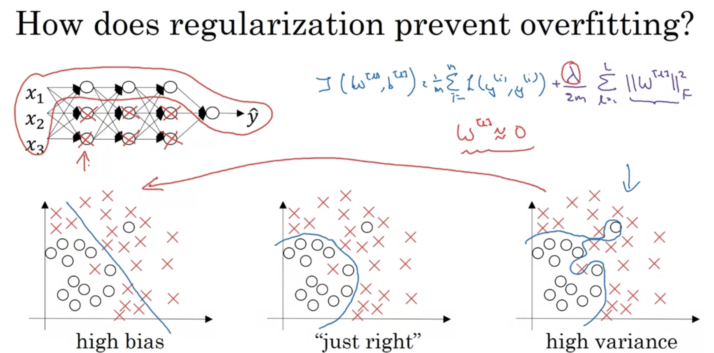
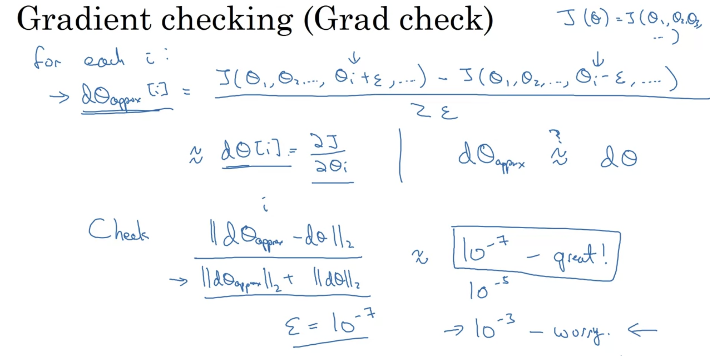
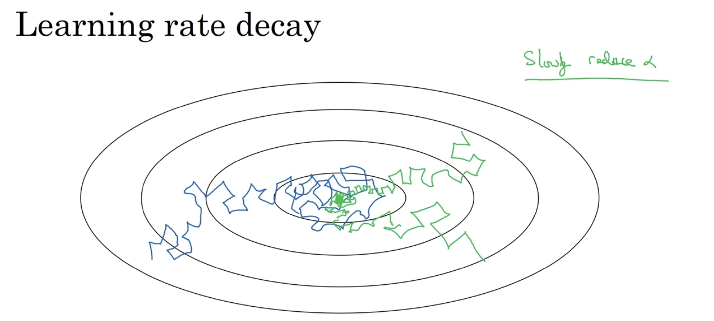

- In this course we will learn about how to make our neural network work well.
- When training a neural network you have to make a lot of decisions such as how many hidden units, how many layers, activation function, and learning rate.
- ML is a highly iterative process, in which you often start with an idea, then code up and then experiment with it and based on the results you make changes and carry out the same process
- Guessing the best choice of hyperparameters at the very first time is almost impossible.
- Hence today Applied ML is a very iterative process.![[Improving Deep Neural Networks/./Images_Course2/img1.png]]
- So, one of the main things that determines how quickly you can make progress is how efficiently you can go through this cycle of idea, code and experiment.

- Also setting up your dataset in train, dev and test can make you much more efficient.
- We train algorithms on our training set and use the dev set or the hold-out cross-validation set to see which of many validation sets is performing well, 
- Then you can take the best model you have and evaluate it on your test set in order to get an unbiased result of how your algorithm is performing.
- The goal of the dev set is that we will test different algorithms on it and see which algorithm works better. So, the dev set just needs to be big enough for you to evaluate two different algorithm choices.
- In the past, we used to split our data as 60% - 20% - 20%(Train, dev, Test). This also used to give good results.
- But, in the modern age where we have a lot of data, the dev and test set has become a very small percentage of the total.
- Because the dev set needs only that much data to decide which algorithm is better.
- And the test set is only for giving us an estimate of how well our algorithm is doing so not much data.

- If we have 1 million training examples, then the distribution is like 10,000 for dev and 10,000 for test and rest for training. Hence 98% - 1% - 1%.
- **Dev and Test Set must come from the same distribution**. This will make learning faster. For example ./Images_Course2 from the same site.
- Sometimes not having a test set is okay. 
- If you only have a dev set and not a test set then you try different model architectures evaluate them on the dev set and use that to iterate and get to a good model.
- Generally, when we don't have any test set and we have only a dev set, then we call that dev set a test set, and we must be careful about that.

# High bias and High Variance
> -  Low bias and large variation: Overfitting occurs when the algorithm produces widely diverse predictions for the same data.
> -  High bias, low variance: Underfitting occurs when the algorithm produces comparable predictions for similar data, but the predictions are incorrect. The features are unable to develop accurate relationship.


- This analysis is totally based on the assumption that human error is nearly 0% in detecting error. If human error is 15% then the criteria will be different.
# Basic Recipe for ML
- First, look if your algorithm has a high bias. For that look at the training set. 
- If it has a high bias, then try a bigger network such as more hidden layers and more hidden units or train longer.
- It might be the case that some other NN model is better suited for the case.
- Bigger NN always works in the case of Underfitting. It will fit the network or even overfit.
- After reducing bias, check if you have a variance problem. For that look at the dev set performance.
- If you have a high variance, the best way to solve the high variance problem is to get more data and try regularization or a more appropriate NN Architecture.
- Depending upon whether we have a high bias or a high variance, the set of things we should try could be quite different.
- Therefore first find out that whether you have a bias or a variance problem and then do the appropriate things and try. 
- If we have a bias problem then increasing the data will not be of much help.
# Bias Variance tradeoff
- At present, we can increase or decrease Bias while keeping the variance the same or vice versa.
- In the past, this was not the case, there were not many ways that could change bias without hurting variance.
- Hence there was a Bias Variance tradeoff because changing one affects the other.
- In the modern era, as long as your network is big and the data is also huge, bias and variance both reduce without hurting the other.
- This is one of the reasons that deep learning is so useful for supervised learning.
- The only problem with training a bigger network is that computational time is large.
# Regularization 
- The first way to tackle the high variance problem is by adding more data. However, more data is not always available. Regularization is another way and it always works.
- It is a way to reduce high variance. There is a little bit of bias-variance tradeoff, that is bias increases a little but is ignorable.
-  For regularization, we just add a term to the loss function.
- This affects derivatives of backprop also.
- Why do we regularize just the parameter vector w and not b?
- This is because w is a high dimensional vector and with a high variance problem. However, b is just a number. We can regularize b but it will not do much effect.
- L2 regularization is the most common type of regularization.
- There is also an L1 regularization in which we add the L1 norm instead of the L2 norm.
- If you use L1 regularization then we will end up being sparse which means the w vector would have a lot of zeros. This might help in compressing the model because the set of parameters is zero so you won't need much memory but does not have a large impact other than that.
- L2 regularization is generally used. 
- Lambda here is a regularization parameter and we set this using the development set where you try a variety of values to see what is best. Lambda is another hyperparameter that we tune. 
- **Note- lambda is a keyword in Python so while coding we will represent it using lambd.**

- This is the case of a logistic regression model. Let's discuss deep neural networks where the loss function is a function of many parameters.
- Here the norm is the sum of all the elements of the weight matrix squared.
- This matrix norm is called as Frobenius norm of the matrix, denoted with subscript F.
- For some reasons that we don't need to know they are known as the arcane norm of the matrix.
- Now, let's see how we will compute the backdrop using this loss function.
- We just need an extra regularization term with our previous backdrop term.
- Because of this extra term, L2 regularization is also known as weight decay because this extra term makes the matrix w a little bit smaller.
- If we take W common so we come to know that we are just multiplying the matrix W by a number less than 1 hence it is known as weight decay.

# Why does regularization help with overfitting
- Let's see a neural network which is currently overfitting.
- What we did for regularizing is add this extra term that penalizes the weight matrices from being too large.
- if lambda is too big then, weight matrices will be close to zero. One thing that can happen is that will make the weights so close to zero for a lot of hidden units such as zeroing out the impact of these hidden units.
- It almost becomes like a logistic regression unit. As a result of a smaller network, overfitting decreases to a high bias case and there will be some values of lambda for which the right case happens.

- Another way to think about how regularization decreases overfitting is:-
- Assume we are using the tanh activation function.
- From the graph, we can see that when z is very small tanh function is almost linear.
- **If Lambda is big, w is small, then z is also small and g(z) is roughly linear like logistic regression.**
# Dropout Regularization
- In addition to L2, regularization there is another technique of regularization known as dropout. 
- In dropout regularization, we will set some probability of eliminating a node in a neural network. Like we have a 0.5 chance of keeping a node and a 0.5 chance of eliminating a node.
- Then, we eliminate those nodes and we end up with a smaller network. 
- On every iteration, we eliminate some nodes and hence we do backprop on a smaller network. 

## How to implement dropout
- There are few ways to implement it but there is a technique called inverted dropout. 
- Let's illustrate with layer l=3
- d3 is a dropout vector for layer 3 of the same shape as a3.
- We will check if this is less than a number which we call, keep_prob
- keep_prob is a number which is a probability that a given hidden unit will be kept. 
- So, if keep_prob is 0.8 then this would mean that there is a 0.2 chance of eliminating any hidden unit.
- Then, we will take activation from the third layer and multiply it with this d3 vector. (Element Wise Multiplication)
- What this does for every element of d3 which is zero it will make the corresponding activation of that hidden unit also zero. Hence d3 ends up zeroing out the corresponding element of d3.
- Then, finally, we will take a3 and scale it up by 0.8 which is keep_prob. We will do this by dividing a3 by 0.8. This compensates for the effect of zeroing out of hidden units. And also ensures that the expected value of a3 remains the same.
- This is known as the inverted dropout technique, dividing by keep_prob.

- This inverted dropout technique makes test time easier because you have less of a scaling problem. 
- **We will not use dropout during the test**.
- Even if we don't make a dropout in the test case, the expected value of activation is the same, because there we divided by 0.8 to keep the activation same.
# Why does dropout work
- Firstly, it decreases the size of the neural network so less overfitting.
- Secondly, Since there is a probability of any weight getting eliminated generally weights are spread out in all the features which reduces overfitting. 
- We will vary Keep_prob with layers. For layers where the hidden units are more, we will keep keep_prob low so that more units get eliminated but for layers where hidden units are more, we will keep_prob higher or even 1 which means no elimination. 
- For the input layer, keep_prob of 1.0 is very common. We usually don't eliminate input features.
- Dropout is very common in computer vision because we are inputting a huge amount of data into the network.
- One thing to remember is that dropout is a regularization technique unless our algorithm is overfitting we will not use the dropout regularization technique.
- One limitation of the dropout regularization is that the cost function is not properly defined and it changes at every iteration. 
- Hence the graph of J vs. no of iteration is less well defined and hard to calculate.
- So, turn off dropout that is keep_prob = 1 and check J is decreasing monotonically, and then turn on dropout. 


# Other Regularization Techniques
1. Data Augmentation
Let's say we build a cat classifier and there is overfitting, then one way to handle is to get more data. But getting more data is expensive and requires a lot of effort, one thing we can do to increase the size of the training set is to rotate the cat ./Images_Course2 or take random crops of it and insert it in the training set.
- This is not as effective as directly adding a brand new image to training set but we are also saving our expense here.


2. Early Stopping
- We plot a graph of the cost function and dev set error, what happens in case of a dev set error is that it decreases at first but then starts to increase after a few iterations. 
- What we do in early stopping is that we stop the training when the error is lowest.
- However early stopping has one downside. 
- In ML we try to optimize J and also not overfit while trying to do it.
- Orthogonalisation means we want to think about one task at a time. 
- What we want to do is that we first optimize the cost function without thinking about overfitting and then we try to overcome the problem of overfitting.
- But in the case of early stopping, we are doing both the tasks simultaneously.
- We have not yet optimized the cost function to a high level but we stopped the training midway to prevent overfitting.

# Normalization
- For speeding up the training normalization is very important.
- Data scaling or normalization is **a process of making model data in a standard format so that the training is improved, accurate, and faster**. The method of scaling data in neural networks is similar to data normalization in any machine learning problem.
## Normalizing training set
- Consider a neural network has two input features only.
- In normalizing there are two steps:-
- The first step is to subtract or zero out the mean. That is we just move the training set until it has zero mean.
- The second step is to normalize the variances.
- Here feature x1 has a much larger variance than feature x2.
- sigma squared is a vector with the variances of each of the features.
- Now, divide X by sigma.
-  Now, we will end up with the variance of both the input feature as 1.
- Note- If you use this to scale your training data, then use the same mean and sigma to normalize your test set as well. This is because you don't want to normalize the training and test set differently.
- Use the sigma and mean value in both.

## Why Normalize the inputs?
- If we use unnormalized input features then it's more likely that the cost function will be very squished out which is a very elongated cost function.
- If we normalize our input features then the cost function will look more symmetric.
- If we are running gradient descent on a cost function like the one on the left then, we might have to use a very small learning rate, because here gradient descent will need a lot of steps to reach minima.
- On the other hand, if the cost function is like the one on the right, then we can keep a high learning rate because wherever we start gradient descent will always go towards the minima.
- If the range of input features is almost the same, then the normalization would not increase the performance much.
- Always do normalization no matter even if the input features are almost in the same range.


# Vanishing/Exploding Gradient
- One of the problems with training deep neural networks is data vanishing and data exploding what that means is that when you are training a very deep neural network then your derivatives or your slopes can sometimes get very big or very small and this makes training difficult.
- Let's consider a deep neural network having L layers with linear activation function and b = 0
- In that case, the Y hat will be as shown.
- Now, We can see that W[1] * X = z[1] = a[1] and more.
- Let's say each of these weight matrices except the last one because it has different dimensions, are just a little bit greater than the identity matrix.
- Then, the y hat will be as shown. This is because we assumed that each weight matrix is equal to 1.5 times the identity matrix.
- Then, essentially the Y hat is equal to 1.5 ^L-1  * X. Hence y hat will be very large.
- Hence, if we have a very deep neural network then the value of y hat will explode.
- Conversely, if we replace this 1.5 with 0.5 and if we have a deep neural network with a number of layers, then the Y-hat will become 0.5 ^L-1  * X.
- That means activation values will decrease exponentially in every next layer and almost become negligible at the end leading to the problem of vanishing.
- Hence, we can conclude that if the weights w are just a little bit greater than the identity matrix then the activation values can explode. And if w is just a little bit less than the identity matrix then the activation values could vanish.
- Similarly, we can prove that with derivatives the same thing occurs.
- This increasing and decreasing is a function of the number of layers.
- If gradients become small, then gradient descent will take very small steps.

## Weight Initialization for Deep Neural Networks
- We can partially solve this problem by careful random initialization of weights.
- For now, let's say b is zero.
- In order for z to not become too large and not become too small, we notice that the larger the n is the smaller the W you want to be.
- One thing we can do is to make the variance equal to 1/n where n is the no of input features going into the neuron.

- It turns out that if you are using a RELu activation function, then rather than 1/n, 2/n is a better option.
- If we multiply our random weight matrix with the square root of this, we end up with the required variance.
- So, if the input features have a mean of zero and standard deviation of 1, then z will also take on the same scale.
- This helps in reducing the problem of vanishing-exploding gradient problem because this will help the weight matrix to not become too big than 1 and too small also so it doesn't explode or vanish too quickly.
- If our activation function is tanh then, instead of 2 in numerator, we generally take 1. This is known as Xavier initialization.
- There is another formula as shown in the right middle but is generally not used.
- So another thing we can tune in our hyperparameter is this term.


# Gradient Checking
- This will help us to figure out if our implementation of the backdrop is correct or not.
- Let's consider a function f(theta) = theta^3, now we want its derivative therefore nudge it to the right to get theta+E. Now, instead of only nudging to the right also nudge it to the left to get theta-E.
- It turns out that rather than only taking this little triangle we get after only nudging to the right of theta, taking the big triangle which includes both nudges, **then we can get a much better estimate of gradient.**
- Then, we will find the slope of the bigger triangle.
- Here g(theta) is the derivative of f(theta).
- The two-sided difference result is as shown.
- It is approximately equal to the actual derivative.

- If we take a one-sided difference then, the approximation error is 0.03
- Hence, a two-sided difference is better as it gives less error.
- It is slower than one-side difference but still prefer this.

- Let's see how we can use this to check the correctness of the backdrop.
# Checking
1. We will reshape all our parameters and then we will concatenate them into a giant vector theta.
2. Therefore now we have a J as a function of theta.
3. Similarly, reshape the derivatives into a giant vector d(theta).
4. d(theta) has the same dimension as theta.
Now, we will check if d(theta) is the gradient of the cost function J.
To implement Grad check what we will do is implement a loop for each component of theta and compute d(theta) by taking two-sided difference.
- For that we will nudge thata i to add epsilon to it.
- Now, this should be equal to d(theta)i
- We will compute this for every component i and then will we end up with two vectors d(theta)approx and d(theta).
- And then we want to check if these two vectors are reasonably close to each other.
- To find whether they are reasonably close to each other or not we will compute the Euclidean distance of these two vectors and then to normalize by the length of these vectors we will divide by d(theta)approx + d(theta).
- The role of the denominator is just in case any of these vectors is very small or very large, the denominator turns this formula into a ratio.
- Generally, we use epsilon = 10^-7
- And if the formula gives us a value of 10^-7 or smaller, then that's great.
- If the value is 10^-5, then have a careful look at your vector and confirm that none of the components is very large. If a component is large, then there might be a bug in your backdrop algo and use that component to track down the bug.



## How to implement gradient checking
- Computing d(theta)i for all values of i does very slow computation.
- Grad check is only used to debug.
- To implement gradient descent use backprop to compute d(theta) and just use backprop to compute the derivative.
- And it's only when you are debugging that we would compute d(theta)approx to make sure it is close to d(theta) and then we will turn it off after checking. 
- If an algorithm fails the grad check then look at the components and try to figure out the bug.
- That is if the error is huge, then check which values of d(theta)approx is very different from d(theta) 
- Assume db for layer l is different where dw for layer l is okay, then there is error in computing db.
- When you are doing grad check remember to include regularization term to the derivative.
- Grad check doesn't work with dropout regularization because there the cost function J is very difficult to compute.
- So implement grad check without dropout and check whether your algo is correct without dropout, for that set keep_prob=1 and then turn on dropout and check that the implementation of dropout is correct.
- Sometimes, this happens that your implementation of gradient descent is correct when w is close to 0 and as we run gradient descent w and b become bigger and larger. So one thing we could do is to run a grad check at random initialisation and then train the network for a while so that w and b get some time to wander away from 0 and then do a grad check again. 


# Important Points
## Initialization

Training your neural network requires specifying an initial value of the weights. A well-chosen initialization method helps the learning process. 
If you completed the previous course of this specialization, you probably followed the instructions for weight initialization and seen that it's worked pretty well so far. But how do you choose the initialization for a new neural network? In this notebook, you'll try out a few different initializations, including random, zeros, and He initialization, and see how each leads to different results.

A well-chosen initialization can:
- Speed up the convergence of gradient descent
- Increase the odds of gradient descent converging to a lower training (and generalization) error.
## We will practice the following initialization techniques:-

1. Zeros initialization_ -- setting `initialization = "zeros"` in the input argument. ----> **Worst**

**What you should remember**:

- The weights 𝑊[𝑙]�[�] should be initialized randomly to break symmetry.
- However, it's okay to initialize the biases 𝑏[𝑙]�[�] to zeros. Symmetry is still broken so long as 𝑊[𝑙]�[�] is initialized randomly.

2. _Random initialization_ -- setting `initialization = "random"` in the input argument. This initializes the weights to **large random values**. -----> Moderate
- This gives better accuracy than above method and breaks the symmetry.
**Observations**:
- The cost starts very high. This is because with large random-valued weights, the last activation (sigmoid) outputs results that are very close to 0 or 1 for some examples, and when it gets that example wrong it incurs a very high loss for that example. Indeed, when log(𝑎[3])=log(0)log⁡(�[3])=log⁡(0), the loss goes to infinity.
- Poor initialization can lead to vanishing/exploding gradients, which also slows down the optimization algorithm.
- If you train this network longer you will see better results, but initializing with overly large random numbers slows down the optimization.

**In summary**:
- Initializing weights to very large random values doesn't work well.
- Initializing with small random values should do better.
The main difference between Gaussian variable (`numpy.random.randn()`) and uniform random variable is the distribution of the generated random numbers:

- numpy.random.rand() produces numbers in a [uniform distribution](https://raw.githubusercontent.com/jahnog/deeplearning-notes/master/Course2/./Images_Course2/rand.jpg).
- and numpy.random.randn() produces numbers in a [normal distribution](https://raw.githubusercontent.com/jahnog/deeplearning-notes/master/Course2/./Images_Course2/randn.jpg).

When used for weight initialization, randn() helps most the weights to Avoid being close to the extremes, allocating most of them in the center of the range.

An intuitive way to see it is, for example, if you take the [sigmoid() activation function](https://raw.githubusercontent.com/jahnog/deeplearning-notes/master/Course2/./Images_Course2/sigmoid.jpg).

You’ll remember that the slope near 0 or near 1 is extremely small, so the weights near those extremes will converge much more slowly to the solution, and having most of them near the center will speed the convergence.

3. He initialization_ -- setting `initialization = "he"` in the input argument. This initializes the weights to random values scaled according to a paper by He et al., 2015. -----> best
- "He Initialization"; is named for the first author of He et al., 2015. (If you have heard of "Xavier initialization", this is similar except Xavier initialization uses a scaling factor for the weights 𝑊[𝑙]�[�] of `sqrt(1./layers_dims[l-1])`where He initialization would use `sqrt(2./layers_dims[l-1])`.)


## Regularization


- Since we are changing the cost, backpropagation derivatives will also change.

**Observations**:

- The value of 𝜆� is a hyperparameter that you can tune using a dev set.
- L2 regularization makes your decision boundary smoother. If 𝜆� is too large, it is also possible to "oversmooth", resulting in a model with high bias.

**What is L2-regularization actually doing?**:

L2-regularization relies on the assumption that a model with small weights is simpler than a model with large weights. Thus, by penalizing the square values of the weights in the cost function you drive all the weights to smaller values. It becomes too costly for the cost to have large weights! This leads to a smoother model in which the output changes more slowly as the input changes.

**What you should remember:** the implications of L2-regularization on:

- The cost computation:
 - A regularization term is added to the cost.
- The backpropagation function:
- There are extra terms in the gradients with respect to weight matrices.
- Weights end up smaller ("weight decay"):
- Weights are pushed to smaller values.


- A **common mistake** when using dropout is to use it both in training and testing. You should use dropout (randomly eliminate nodes) only in training.
- Deep learning frameworks like [TensorFlow](https://www.tensorflow.org/api_docs/python/tf/nn/dropout), [PaddlePaddle](https://www.paddlepaddle.org.cn/documentation/docs/en/api/paddle/nn/Dropout_en.html#dropout), [Keras](https://keras.io/api/layers/regularization_layers/dropout/) or [caffe](https://caffe.berkeleyvision.org/doxygen/classcaffe_1_1DropoutLayer.html) come with a dropout layer implementation. Don't stress - you will soon learn some of these frameworks.
**What you should remember about dropout:**

- Dropout is a regularization technique.
- You only use dropout during training. Don't use dropout (randomly eliminate nodes) during test time.
- Apply dropout both during forward and backward propagation.
- During training time, divide each dropout layer by keep_prob to keep the same expected value for the activations. For example, if keep_prob is 0.5, then we will on average shut down half the nodes, so the output will be scaled by 0.5 since only the remaining half are contributing to the solution. Dividing by 0.5 is equivalent to multiplying by 2. Hence, the output now has the same expected value. You can check that this works even when keep_prob is other values than 0.5.

# Gradient Checking


# Optimization Algorithms
- What we are doing till now, is that we train our neurons for all the training data and then, perform the gradient descent step.
- But, there is a faster way.
- Split up your training set into smaller or baby training sets.
- These baby training sets are called mini-batches.
- Let's say there are 1,000 examples only in one mini-batch.
- We will denote the mini-batches with X superscript curly braces.
- If the whole training set is of 5,000,000 examples, then there are 5,000 mini-batches.

- To implement this we will run a loop for 5000 times because there are 5000 mini batches and in each loop we will take a gradient descent step.

- In mini-batch gradient descent, we take many gradient descent steps in one pass over the training set.

- In batch gradient descent cost always decreases, but in mini-batch gradient descent cost might increase in some mini batch and then decrease in other but as a whole the cost decreases.
# Choosing your mini-batch
- If the mini-batch size is m, then we end up with batch gradient descent.
- If the mini_batch size is 1, then we say that the algorithm as stochastic gradient descent and every example is its own mini-batch and performs gradient descent.
- In batch gradient descent there is low noise and large steps whereas in stochastic gradient descent noise is high and also the steps are short.
- Sometimes it goes in the wrong direction as well but on average the direction is good.
- Also, it won't ever hit the minimum just wander around it.
- Mostly, the mini-batch size is b/w 1 and m.
- the disadvantage of batch training set is that it takes a too long time to execute
- The disadvantage of Stochastic gradient descent is inefficient sometimes goes towards minima and sometimes does not.
- size of b/w 1 and m is best.
- We get the fastest learning this way. We don't need to wait for learning before reading the entire training set.
- For small training sets use batch gradient descent for example size less than 2000.
- Best Mini batch size is in 2 to the power starting from 6.(2^6).

- make sure your mini batches fit your CPU or GPU memory.
- Therefore mini-batch size is another hyperparameter to tune.

# Exponentially Weighted Averages
- There are some algorithms which are faster than gradient descent but in order to understand those algorithms let's first understand this.
- The shown data is noisy.
- If we want to compute the weighted average we will do as shown.
- If we compute as shown we will get the moving or exponentially weighted average of the daily temperature.

- We can think of Vt as averaging over 1/1-beta days temperature.
- For example, when beta = 0.9, we can think of beta as averaging over last 10 days example, the red line is for beta = 0.9 and if beta = 0.98, then 1/1-beta is 50, this is taking the average over the last 50 days. The green line is for beta = 0.98.
- When beta is high, the plot we get is much smoother because we are averaging over more days of temperature so less noise.
- On the flip side, the curve is now shifted to the right side because we are averaging over a much larger size.
- By averaging over a larger size, the exponentially weighted formula adapts more slowly when the temperature changes. 
- There's a bit more latency.
- This is because when the beta is high that is 0.98, then it gives a lot of weight to the previous value and a lot less weight (0.02) to the current value.
- Therefore, when temperature changes and beta is large, then the exponentially weighted average adapts more slowly.
- If we plot for beta = 0.5, then we get the graph as shown by yellow.


- By averaging over two days temperature, then more noise but it adapts quickly to temperature changes.
- The red curve is a better average than the yellow or the blue curve.
## How is it computing averages of the daily temperature?
- Here, we have an exponentially decaying function which shows the decaying curve of various coefficients.
- The other is a plot of temperature vs. day.
- If we multiply these two curves element-wise, we will get our exponentially weighted average which is V100 here.
- So, we are just taking the daily temperature and multiplying it with exponentially decaying function and then summing it up.
- There is a thing here that the sum of all the coefficients here is 1 or very close to 1.
- How many day's temperature is it averaging over?
It takes about 10 days for that constant to decay to about 1/3rd or around 1/e of the peak.
- It is because of this reason that when the beta is equal to 0.9 we say that we are computing an exponentially weighted average of the last 10 days because after that the weight decays to less than about 1/3rd of the current day's weight.
- for beta = 0.98, turning that 0.98 to the power of 50 is approx = 1/e therefore we can think for beta = 0.98 to be averaging over about the last 50 days' temperature.
- We can find the average no of days by 1/1-beta where 1-beta is epsilon only.

- Implementation is on the right of the next image.
- Exponentially weighted average takes very little space, we just need a single variable V to store the average.

- This is not the best or the most accurate way to compute averages but if we compute averages like we always do then we would have to maintain the note of all the temperature and is complicated to implement. 

# Bias Correction 
- We notice that when we actually implement this the starting is lower than expected.
- If the first day's temperature is 40 degrees and if initially V=0, then by the formula V1 = 0.02 * 40 which is 0.8. This is because V0 is equal to 0.
- Similarly, V2 and more are not a good estimate of the first few day's temperatures of the year.
- There is a way to modify it to make it much better.
- Instead of Vt take, Vt/1-beta^t
- This removes the bias.
- When t is large, the beta^t is very small, hence denominator almost approaches 1. Hence when t is large, the bias correction won't make any difference and it is good because when t is big we already get the expected results.


# Gradient descent with momentum 
- Gradient descent with a momentum algorithm always works faster than the general gradient descent.
- Here we compute the exponentially weighted average of the gradient and then use it to update the parameters.
- In mini-batch gradient descent, there is vertical motion also which we don't want, as it slows down the learning rate.
- And if the learning rate is too big, then we might end up overshooting or diverging.
- On the horizontal axis, we want faster learning but on the vertical axis, we want slower learning.
- What the Gradient descent with momentum does is smooth out the steps of gradient descent.
- We find out that the derivatives computed this way have an average of nearly 0 in the vertical direction but move quickly in the horizontal direction.
- Consider a bowl-shaped function and a ball rolling down on it. Then, we think of the derivative term as providing acceleration to the ball you are rolling downhill and the momentum term we think of as representing the velocity and we think of beta as friction.
- Now, we have another hyperparameter beta which controls our exponentially weighted average. The most common value of beta is 0.9 so it is averaging the last ten iterations gradient.
- **Bias Correction** - We don't usually do this because after just 10 iterations there is no need of it.
- VdW and Vdb has same dimensions as dW and db.
- Sometimes the (1-beta) term is omitted as it compensated in the learning rate.


# RMSprop 
- It stands for Root Mean Square prop and it can also speed up gradient descent.
- Consider the horizontal axis as w and the vertical axis as b, Actually, the axis could of anything but for the sake of intuition we can think of it like this, so now we want to slow down the learning in the b direction and speed it up in the w direction.
- Instead of VdW, let's say SdW and the same for b.
- In our example, the slope is big in the b direction and small in the w direction, therefore, dW is small and db is big. Hence SdW is small and Sdb is big.
- Hence we are dividing dW by a small number making it big and dividing db by a large number making it small. Hence our oscillations in the vertical direction are damped.
- Here, we can also use a larger learning rate.
- Here, instead of calling beta, let's call it beta subscript 2.
- Just to make sure SdW and Sdb are not zero we add a very small number of epsilon while dividing to maintain numerical stability.

# Adam optimization Algorithm
- If we put RMSprop and momentum algorithm together, we get an even much better algorithm.
- In typical Adam optimization, we also do bias correction.
- This algorithm has a number of hyperparameters.
- Generally, for alpha we do tuning.
- For beta2, 0.999 is recommended.
- Adam stands for Adaptive moment estimation.
- Beta1 is used for computing the mean of the derivatives. This is the first moment.
- Beta2 is used for computing the exponentially weighted average of the squares.
This is known as the second moment.


# Learning Rate Decay
- Learning rate decay means slowly decreasing your learning rate over time.
- In mini-batch gradient descent, our algorithm will never reach the minimum but will keep wandering around the minimum.
- But, if we slowly reduce the learning rate then the gradient will converge better. 
- Initially, when alpha is big, it will take big steps then alpha keeps on decreasing and converges better.
- There are many ways to implement learning rate decay.
- Keeping learning rate as a function of epoch, learning rate gradually decreases.


- There are other ways to implement this.
- Sometimes when the training is too long, manually decaying of learning rate is also an option. 


# The problem of local optima
- In the past, we used to think of local optima by considering a 2D plane. But it isn't correct.
- We came to know that most points of zero gradient in a cost function aren't actually local optima. 
- We came to know that most points of zero gradient in a cost function are actually saddle points.
- If the gradient is zero in a function of very high dimensional space then in each direction there could be a convex-like function or a concave-like function which has very low chances.
- These are saddle points not local optima.
- This is called saddle point because this is like the saddle of a horse.
- So, local optima aren't really a problem 
- The actual problem is of plateau. 
- A plateau is a region where the derivative is close to zero for a long time. 
- This is where algorithms like Adam help a lot.


# Important points


- Shuffling and Partition are two steps to build mini batches and powers of 2 are often chosen to be mini_batch_size.

  
- The velocity is initialized with zeros. So the algorithm will take a few iterations to "build up" velocity and start to take bigger steps.
- **How do you choose 𝛽�?**
   - The larger the momentum 𝛽� is, the smoother the update, because it takes the past gradients into account more. But if 𝛽� is too big, it could also smooth out the updates too much.
   - Common values for 𝛽� range from 0.8 to 0.999. If you don't feel inclined to tune this, 𝛽=0.9�=0.9 is often a reasonable default.
   - Tuning the optimal 𝛽� for your model might require trying several values to see what works best in terms of reducing the value of the cost function 𝐽�.

Momentum usually helps, but given the small learning rate and the simplistic dataset, its impact is almost negligible.
On the other hand, Adam clearly outperforms mini-batch gradient descent and Momentum. If you run the model for more epochs on this simple dataset, all three methods will lead to very good results. However, you've seen that Adam converges a lot faster.
Some advantages of Adam include:

- Relatively low memory requirements (though higher than gradient descent and gradient descent with momentum)
- Usually works well even with little tuning of hyperparameters (except 𝛼�)
- Notice that if you set the decay to occur at every iteration, the learning rate goes to zero too quickly - even if you start with a higher learning rate.

|   |   |   |
|---|---|---|
|**Epoch Number**|**Learning Rate**|**Cost**|
|0|0.100000|0.701091|
|1000|0.000100|0.661884|
|2000|0.000050|0.658620|
|3000|0.000033|0.656765|
|4000|0.000025|0.655486|
|5000|0.000020|0.654514|

When you're training for a few epoch this doesn't cause a lot of troubles, but when the number of epochs is large the optimization algorithm will stop updating. One common fix to this issue is to decay the learning rate every few steps. This is called fixed interval scheduling.
# Calculate the new learning rate using exponential weight decay with fixed interval scheduling.

- **Instructions**: Implement the learning rate scheduling such that it only changes when the epochNum is a multiple of the timeInterval.

**Note:** The fraction in the denominator uses the floor operation.

𝛼=1/1+𝑑𝑒𝑐𝑎𝑦𝑅𝑎𝑡𝑒×(𝑒𝑝𝑜𝑐ℎ𝑁𝑢𝑚/𝑡𝑖𝑚𝑒𝐼𝑛𝑡𝑒𝑟𝑣𝑎𝑙) * Initial_learning_rate
- With Mini-batch GD or Mini-batch GD with Momentum, the accuracy is significantly lower than Adam, but when learning rate decay is added on top, either can achieve performance at a speed and accuracy score that's similar to Adam.

In the case of Adam, notice that the learning curve achieves a similar accuracy but faster.
# Hyperparameter Tuning
- There are many hyperparameters to tune.
- Alpha is the most important hyperparameter to tune.
- The hyperparameters in yellow are the second important hyperparameters.
- The ones in purple are the third most important.
- The values for beta1, beta2 and epsilon never needs to be tuned.
- 
- In earlier times, if we wanted to tune two hyperparameters, we used a grid(the left one). The points were sampled in a grid.
- Then, we try out all 25 points and pick up whichever hyperparameter works best.
- But, in deep learning choose the points at random and try out all different values.
- It's difficult to know which hyperparameter is going to be the most important for our problem. Some hyperparameters are more important than others.
- For example, if the right vertical axis is alpha, then we are only trying 5 values for it on a total of 25 models. But on the right all 25 models have different alpha.
- In practice, there could be many more hyperparameters.

## Coarse to fine sampling scheme
- Firstly, we will find the best tuning and then zoom on it and try out more sample points and try to find the best one in that region.

## Using an appropriate scale to pick hyperparameters
- Sampling at random doesn't mean sampling uniformly at random.
- Instead, it's important to pick the appropriate scale.
- We usually take a log scale.
- In some cases, like if we want to select the number of hidden units or the number of layers, then a guess between a range is a good idea. However, this does not work in all cases.
- Let's say we come to know that alpha is good in the range of 0.0001 and 1, it is not practically possible to check for all values in the range between it so we will take a log scale.
- We will find the log of the low and high values.

### Let's see how the sampling of beta is done
- The range of beta is 0.9 - 0.999.
- Let's find the value for 1 - beta which is going to range from 0.1 - 0.001.


## Babysitting one model
- We do this when the dataset is big but we don't have a lot of CPUs and GPUs, so we can basically afford to train only one model at a time.
- In such a case we will babysit our model.
- We will watch our learning curve, nudge some hyperparameters up and down and will watch how our cost function is performing.
- This is like babysitting the model one day at a time and changing a few hyperparameters for it to perform well. 
### Training many models in parallel
- We will run different models parallely with different hyperparameter settings and will stick with the one which works the best.
- Let's call the babysitting approach pandas and the other caviar and the way to choose between these is a function of how many computational resources we have.


# Batch Normalization 
- We know that normalizing the input features helps a lot in learning. We only understood normalizing the input features.
- For a deeper model if we normalize the activations then training of the subsequent layer will be faster. 
- How to normalize a[2] to make the training of W[3] and b[3] faster. 
- We will normalize the values of z[2] and not of a[2].


After this, every unit of z has a mean of 0 and a variance of 1.
- But, we don't want our hidden units to always have mean 0 and variance 1. It makes more sense for hidden units to have a different distribution. 
- So, we will find Z tilde after Z norm.
- Where gamma and beta are learnable parameters.
- That means we will update the parameters gamma and beta during gradient descent or whichever backprop algo we are using. 
- **The effect of gamma and beta is that it allows you to set the mean of the z-tilde to be whatever you want it to be.** We can set it during learning to whatever we want.
- The batch norm only applies the normalization to other hidden layers as well. 
- One difference between the normalization of the input layer and of the hidden layer is that we don't our hidden unit values to have a mean of 0 and 1.
- So, what batch norm does is it normalizes the mean and variance of these hidden unit values to have some fixed mean and variance. The values could be anything and are controlled by lambda and beta.
- **Note - This beta is different from Adam optimization algo beta**
### Let's see how to compute batch norms for deep network

- **Note - When we use a deep learning framework then we don't have to implement the batch norm ourselves. We just have to write one line.**
- Usually, the batch norm is applied with mini-batches.
- While computing Z we add the bias term but in batch norm bias has no meaning because bias is a constant which is added to all the terms and while computing mean and then subtracting it from Z will just cancel out its effect. So, we will remove bias while computing Z.
- Therefore, while computing batch norm we can eliminate the parameter bias.
- It is sort of replaced by beta L. It affects shift or the bias terms.
- Beta and gamma are used to scale the mean and variance of each of the hidden units.


# What does Batch norm do
- The batch norm speeds up the algorithm in the same way as normalizing the input features does. Normalizing the input features makes them to have the same range and hence the learning speed is increased.
- It makes the weights deeper in our network more robust to changes in earlier layers of our network.
- Let's say we trained a neural network on cat detection and we only input black cat ./Images_Course2.
- If we now try to apply this NN on colourful cats, then the cost function will not perform well.
- Therefore if our training set looks like this where the positive examples are on one side and the negative on the other and we try to generalize it on some other set, then the NN will not perform better.
- This idea of data distribution changing goes by the name of covariate shift.
- The idea is that if you have learned some X to Y mapping and if the distribution of X changes then you might have to retrain your learning algorithm.
- 
## Let's see why this is a problem with NN
- Let's say we are calculating the parameters W[3] and b[3]. It takes activations from the previous layer. The activations of the previous layer itself depend upon the parameters of its previous layer and therefore it is continuously changing at every iteration. 
- Hence the problem of covariate shift is faced by W[3] and b[3].
- So, what batch norm does is that it reduces the amount by which these hidden unit values shift around.
- What batch norm is that even if the values of Z[2] changes but the mean and variance will remain the same. 
- Therefore it reduces the amount to which changing the values in the earlier layers affects Z[2].
- Hence batch norm produces more stable layers.
- Hence each layer learns by itself a little bit more independently.
- Batch norm also have a regularization effect.
- We know that in batch norm the value Z[l] is scaled by the values computed in just that mini batch. Hence there is a bit of noise in that. Therefore, the scaling process is noisy as well.
- So similar to dropout it has some noise in that hidden layer activation.
- Because by adding noise to the hidden units, it's forcing the downstream hidden units not to rely too much on any one hidden unit.
- 
# Batch norm at test time
- Batch norm processes the data one mini-batch at a time.
- But at the test time, you might need to process the examples one at a time.
- Here, mu and sigma squared are computed on the entire mini-batch. 
- In typical NN we estimate the mu and sigma squared for the test using exponentially weighted average where the average is across the mini batches while training.
- 

# Softmax Regression
- It is used when we have multiple possible classes.
- Here, the number of units in the output layer is equal to number of classes.
- 
- 
- Softmax activation function takes in a vector and output a vector.

# Training a Softmax Classifier
- The largest element ends up being the biggest probability.
- This is called softmax because it is in contrast with the hardmax. 
- In hardmax, the biggest element gets one and the rest all 0.
- If the number of classes is 2, then softmax is just computing the way logistic regression will compute.
- Because in case of 2 classes our output vector will have 2 values which sum to zero and since they sum to zero we only need to keep track of one value and hence it is the same as in logistic regression. 
- 
- In case of softmax activation function cost function is like shown below:-


For Y to be like the above vector we usually do one hot encoding.

# Programming Framework
- In these frameworks, we only focus on getting the forward prop right and then the framework will figure out by itself how to compute the backprop.
- For implementing very large models we use programming frameworks.
- 

# Tensorflow
- Let's say we have a cost function which we want to minimize using TensorFlow.
- 
- For minimizing J ----> w = 5. But we will use TensorFlow for that.
- Because the same structure can be used to minimize cost which is a function of multiple parameters.
- To signify that w is a variable in TensorFlow we will use, 
```tensorflow
W = tf.Variable(0, dtype = tf.float32)
```
The first argument Initializes w to zero. The second argument defines its datatype.
- Now let's define the optimization algorithm we will use.
```
optimizer = tf.keras.optimizers.Adam(0.1)
```
- Here, 0.1 is the learning rate which we want to use.
- Here, we use the Adam optimization algorithm.
- In TF we only have to write until we compute the cost function, then the TF will figure out how to compute the backprop.
- One way to do this is to use gradient tape.
```
with tf.GradientTape() as tape:
	J = w**2 - 10*w + 25
```
Here, we write the gradientTape and say that it computes the cost as follows.
- In order to carry out one iteration of training we have to define what are the trainable variables.
```
trainable_variables = [w]
```
Then we will compute the gradients as shown:-
```
grads = tape.gradient(cost, trainable_variable)
```
- After this, we can use the optimizer to apply the gradients
```
optimizer.apply_gradients(zip(grads, trainable variables))
```
- Zip variable is a Python function to pair up the corresponding elements of the two lists.
- 
- Till now, our cost function was just a function of parameter w.
- Let's say cost function is not just a function of parameter w but it also depends upon the training data.
- Let's say x is our data. Here, we define it as a list of numbers. For this example let's say x has our coefficients.
```
optimizer.minimize(cost, trainvariables)
```
This is a short syntax for doing back prop and computing gradient and updating the parameters.


# Important Points
## 2 - Basic Optimization with GradientTape[](https://bctsvvwolxfp.labs.coursera.org/notebooks/release/W3A1/Tensorflow_introduction.ipynb#2---Basic-Optimization-with-GradientTape)

The beauty of TensorFlow 2 is in its simplicity. Basically, all you need to do is implement forward propagation through a computational graph. TensorFlow will compute the derivatives for you, by moving backwards through the graph recorded with `GradientTape`. All that's left for you to do then is specify the cost function and optimizer you want to use!

When writing a TensorFlow program, the main object to get used and transformed is the `tf.Tensor`. These tensors are the TensorFlow equivalent of Numpy arrays, i.e. multidimensional arrays of a given data type that also contain information about the computational graph.

Below, you'll use `tf.Variable` to store the state of your variables. Variables can only be created once as its initial value defines the variable shape and type. Additionally, the `dtype` arg in `tf.Variable` can be set to allow data to be converted to that type. But if none is specified, either the datatype will be kept if the initial value is a Tensor, or `convert_to_tensor` will decide. It's generally best for you to specify directly, so nothing breaks!
- Since TensorFlow Datasets are generators, you can't access directly the contents unless you iterate over them in a for loop, or by explicitly creating a Python iterator using `iter` and consuming its elements using `next`. Also, you can inspect the `shape` and `dtype` of each element using the `element_spec` attribute.
- this is how to define a constant X with the shape (3,1):

```python
X = tf.constant(np.random.randn(3,1), name = "X")
```

Note that the difference between `tf.constant` and `tf.Variable` is that you can modify the state of a `tf.Variable` but cannot change the state of a `tf.constant`.

You might find the following functions helpful:

- tf.matmul(..., ...) to do a matrix multiplication.
- tf.add(..., ...) to do an addition.
- Cast your tensor to type `float32` using `tf.cast`, then compute the sigmoid using `tf.keras.activations.sigmoid`.


-  tf.math.add
- tf.linalg.matmul
- tf.keras.activations.relu
- Implement the total loss function below. You will use it to compute the total loss of a batch of samples. With this convenient function, you can sum the losses across many batches, and divide the sum by the total number of samples to get the cost value.

- It's important to note that the "`y_pred`" and "`y_true`" inputs of [tf.keras.losses.categorical_crossentropy](https://www.tensorflow.org/api_docs/python/tf/keras/losses/categorical_crossentropy) are expected to be of shape (number of examples, num_classes).
- `tf.reduce_sum` does the summation over the examples.
- You skipped applying "softmax" in `Exercise 5` which will now be taken care by the `tf.keras.losses.categorical_crossentropy` by setting its parameter `from_logits=True` (You can read the response by one of our mentors [here](https://community.deeplearning.ai/t/week-3-assignment-compute-total-loss-try-to-set-from-logits-false/243049/2?u=paulinpaloalto) in the Community for the mathematical reasoning behind it. If you are not part of the Community already, you can do so by going [here](https://www.coursera.org/learn/deep-neural-network/ungradedLti/ZE1VR/important-have-questions-issues-or-ideas-join-our-community).)